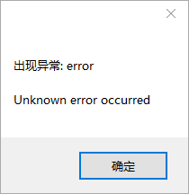

# 常见问题解答（QA环节）

## Q：使用HMCL时无法连接到更新服务器却能继续启动游戏

这种情况多发生于使用启动前指令启动本软件的场景下，因为HMCL机制的问题，无法正确地处理退出代码(ExitCode)，也就会继续运行了。不过此问题影响并不大。

由于HMCL机制所致，此问题暂时无解

## Q：弹框：出现异常: error

具体原因为Python代码的异常，传递到JS层后却没能正常显示错误详情（比如配置文件格式错误等）

以下解决方法任选其一即可

### 解决方法1（推荐）

升级到2.6.1或者更高版本，后续版本修复了`index.js`的逻辑问题，可以显示错误详情

### 解决方法2

1. 从源码仓库克隆2.6alpha3的Commit的源文件（https://github.com/updater-for-minecraft/Hotupdate/tree/4d177fb65b00d931107c0606b2a756864369cf60）
2. 复制仓库下的`assets`目录到服务端的`hotupdate`目录下
3. 打开`assets/index.js`，跳转到159行`on_error`函数
4. 在`detail+'\n'`后面添加`+trackback`语句，使其变成`alert('出现异常: '+type+'\n\n'+detail+'\n'+trackback)`即可完整输出报错信息
5. 保存退出
6. 重新运行客户端等待升级完毕后即可输出异常信息