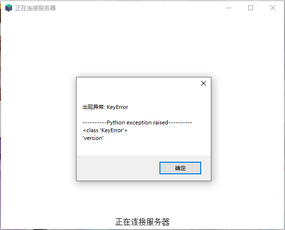

# 常见问题解答（QA环节）

## 360报毒

影响范围：全版本

因为updater依赖cef，所以会在exe包中内置一个libcef.dll，360会将其误识别成chrome，从而报毒（因为cef全程就是Chromium Embedded Framework）

如果仍然不放心，可以到GitHub仓库审阅程序源代码，所有updater相关的程序均是开源的，构建也采用的github actions构建，可以把构建输出的hash与本地文件hash进行对比，以确认源代码的有效性

解决办法：目前只能手动加入白名单

## 点击运行后无任何反应

请检查热更新包是否放到了正确的位置（`.minecraft/updater/`下）

另外请检查`.minecraft/`目录下有无生成名为`updater.error.log`的文件

## utf-8 codec can't decode byte 0xc0

影响范围：全版本

生成的`updater.error.log`中包含以下内容：

此问题触发概率未知，具体原因可能是内部端口冲突，导致读取了错误的数据

解决办法：在客户端配置文件`updater.setting.json`里增加一个配置项：`"cef_with_httpserver": false`

## FailedToConnectError

此错误经常在网络不稳定时出现，请多试几次，如果仍然出现这个问题，请将弹框中的URL复制到浏览器进行访问，如果浏览器也打不开请检查电脑网络是否通畅，域名是否拼写正确

## UnableToDecodeError

服务器返回了无法解码的数据，一般为没有权限访问或者是url设置有误，请根据具体返回的原始数据判断是何种问题

## UnexpectedTransmissionError

连接中断，此错误经常在网络不稳定时出现，请多试几次

## UnexpectedHttpCodeError

服务器返回了非正常状态码，请根据具体返回的原始数据判断是何种问题

## re.error

正则表达式编写有误，一般多为转义字符使用不正确导致

## UnknownWorkModeError

工作模式填写不正确，只能填写`common`或者`exist`，不能填写其它的值

## NotInRightPathError

没有把热更新包放到正确的位置

解决方法：需要把热更新包放到`.minecraft/updater`里

### NoSettingsFileError

找不到`.minecraft/updater.settings.json`配置文件

解决方法：检查这个文件是否存在，文件名是否正确

## PermissionError

影响范围：热更新包2.6.5f1

因为在服务端配置文件的regexes中所列出的目录，在服务端resources目录里不存在，所以会报这个错误

发生此错误时，还可能会误删`.minecraft`目录下的文件

解决方案：升级到2.6.5f2及以上版本

## check_hostname requires server_hostname

影响范围：小工具全版本

原因：可能是电脑开启了代理上网导致

异常全称`qcloud_cos.cos_exception.CosClientError: check_hostname requires server_hostname`，这个是腾讯COS SDK的bug，是腾讯的锅，不是我代码的问题，我也不知道怎么回事就报这个错误了，多数是在上传到腾讯对象存储时触发的这个问题，只能等腾讯修复了

解决方案：尝试关闭代理，或者给小工具设置白名单，或者在虚拟机里使用小工具

## KeyError：'client'

影响范围：热更新包2.5.x

当服务端版本和热更新包版本不匹配时就会出现这个错误，一般是热更新包版本为2.5.x时，服务端版本为2.5时会出现这个问题

解决方案：

1. 将服务端降级到2.3或2.4版本
2. 将客户端升级到2.6.x版本

## KeyError

影响范围：热更新包2.6.1升级到2.6.2或者2.6.3时

需要一并升级服务端到对应的版本，如果使用静态服务端，也可以手动添加一个json属性来解决

## 使用HMCL时无法连接到更新服务器却能继续启动游戏

影响范围：全版本

这种情况多发生于使用启动前指令启动本软件的场景下，因为HMCL机制的问题，无法正确地处理退出代码(ExitCode)，也就会继续运行了。不过此问题影响并不大。

由于HMCL机制所致，此问题暂时无解

## error

影响范围：热更新包2.6.1

具体原因为Python代码的异常，传递到JS层后却没能正常显示错误详情（比如配置文件格式错误等）

以下解决方法任选其一即可

### 解决方法1（推荐）

升级到2.6.1或者更高版本，后续版本修复了`index.js`的逻辑问题，可以显示错误详情

### 解决方法2

1. 从源码仓库克隆2.6alpha3的Commit的源文件（ https://github.com/updater-for-minecraft/Hotupdate/tree/4d177fb65b00d931107c0606b2a756864369cf60 ）
2. 复制仓库下的`assets`目录到服务端的`self`目录下
3. 打开`assets/index.js`，跳转到159行`on_error`函数
4. 在`detail+'\n'`后面添加`+trackback`语句，使其变成`alert('出现异常: '+type+'\n\n'+detail+'\n'+trackback)`即可完整输出报错信息
5. 保存退出
6. 重新运行客户端等待升级完毕后即可输出异常信息