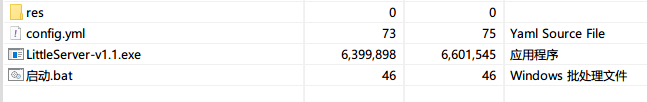
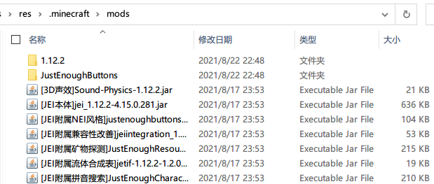

## 单文件服务端

1. 把整个`单文件服务端`文件夹解压到桌面上（或者其它任何地方）



| 文件             | 用途                                   |
| ---------------- | -------------------------------------- |
| res              | 存放要参与更新的文件                   |
| config.yml       | 服务端配置文件                         |
| LittleServer.exe | 服务端主程序文件                       |
| 启动.bat         | 启动服务端主程序的脚本（推荐这样启动） |

2. 将要更新文件，比如模组文件，复制到`res/.minecraft/mods/`里面（`.minecraft/mods/`目录请自行创建）



3. 将其它要参与更新的文件同样按上面的方法，复制到对应的目录上（比如Vexview的贴图复制到`res/.minecraft/vexview/textures/`下）
4. 编辑服务端配置文件`config.yml`，在`common_mode`下写上所有需要参与更新路径

```yaml
# 监听地址
address: 0.0.0.0
# 监听端口，如果冲突了请换一个别的端口
port: 8850

# 这里填写要更新的文件
# 路径分隔符只能使用正斜线，如果用反斜线出了问题请自行解决！
common_mode:
  - .minecraft/mods/*.jar
  - .minecraft/vexview/textures/*

# 不用填写
once_mode: []
```

关于配置文件的配置参考和更多示例可以点击[这里](ServerConfigurationReference.md)

5. 到这里服务端配置完毕，然后是客户端

## 客户端安装

!> 在安装之前，务必备份原有客户端，以防配置出错误删文件！

<!-- tabs:start -->

### **正式版客户端**

[OfficialClientInstallation.md](OfficialClientInstallation.md ':include')

### **Jar版客户端**

[JarClientInstallation.md](JarClientInstallation.md ':include')

<!-- tabs:end -->

## 遇到问题/报错怎么办?

[RunningIntoTrouble.md](RunningIntoTrouble.md ':include')

## 后续维护

得益于软件的同步式更新架构，后续的客户端维护其实是非常简单的：

+ 给客户端新增文件：在服务端**添加**对应的文件，客户端那边下次启动时，就会同步更新（即时生效）
+ 删除客户端的文件：在服务端**删除**对应的文件，客户端那边下次启动时，就会同步更新（即时生效）
+ 更新客户端的文件：在服务端**替换**对应的文件，客户端那边下次启动时，就会同步更新（即时生效）

不仅仅是文件，文件夹也是和上面一样的更新逻辑。这样，服务端的内容，就会自动同步到客户端那边。如果没有按预期更新，请检查一下对应的文件/目录是否忘了添加更新规则。

## 高级功能

[AdvancedTopic.md](AdvancedTopic.md ':include')