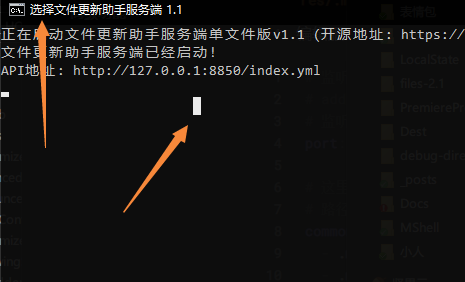

## 单文件服务端

!>  本软件（包括所有子组件）没有使用Log4j依赖库，不会受到Log4j 0day CVE漏洞的影响，可放心使用！

> 如果你是第一次使用单文件服务端，请跳过下面的说明

说明：服务端从3.7版本开始，单文件服务端从Python打包的Exe文件换成了Kotlin打包Jar文件，以此来解决兼容性的问题。如果没有特殊需求，建议过渡到Jar版本。

服务端从3.7版本开始，运行Jar文件需要Java 8或者更高版本的运行环境，Java请自行安装，OracleJDK和OpenJDK均可，或者JRE也可以。

此次升级是兼容升级，除了文件格式不同以外，其它部分，比如配置文件写法和运行停止方式仍然和原来是一致的！！！~~所以不要来问我换了新版本之后怎么启动或者怎么升级配置文件之类的问题！~~

---

!> 安装时请务必仔细阅读教程，不然出一点儿差错都会导致配置不起来！

1. 环境要求：安装Java 8或者以上版本
2. 把整个`单文件服务端`文件夹解压到桌面上（或者其它任何地方）


| 文件                    | 用途                                   |
| ----------------------- | -------------------------------------- |
| res                     | 存放要参与更新的文件                   |
| config.yml              | 服务端配置文件                         |
| LittleServer.exe或者jar | 服务端主程序文件                       |
| 启动.bat                | 启动服务端主程序的脚本（推荐这样启动） |

2. 把`mods`目录里面**所有**的文件，都复制到`res/.minecraft/mods/`里面（`.minecraft/mods/`目录请自行创建），注意不是只复制需要新增的文件，而是要复制所有文件


3. 将其它要更新的文件同样按上面的方法，复制到对应的目录上（比如Vexview的贴图复制到`res/.minecraft/vexview/textures/`下）
4. 编辑服务端配置文件`config.yml`，在`common_mode`下写上所有需要参与更新路径

```yaml
# 监听地址，高级参数，请勿随意修改
# address: 0.0.0.0
# 监听端口，如果冲突了请换一个别的端口
port: 8850

# 这里填写要更新的文件
# 路径分隔符只能使用正斜线，如果用反斜线出了问题请自行解决！
common_mode:
  - .minecraft/mods/*.jar
  - .minecraft/vexview/textures/**

# 不用填写
once_mode: []
```

关于配置文件的配置参考和更多示例可以点击[这里](ServerConfigurationReference.md)，注意每次修改`config.yml`后，需要重启单文件服务端才会生效。如果仅仅是修改要更新的文件，则不用重启

---

然后需要验证服务端是否正确工作（这一步很重要，请不要跳过）：使用浏览器打开黑框里的API地址，如果浏览器显示了类似下面代码框里的yaml格式的内容。那么恭喜！服务端配置无误（格式对得上就可以了，实际内容可能不完全相同）

```yaml
update: res
address: 127.0.0.1
mode: common
common_mode:
  - '.minecraft/mods/**'
once_mode: [ ]
```

如果不是，请自行排查原因，因为这不是程序BUG，是你网络环境的问题！

如果一切配置正确，那么到这里服务端配置完毕，接下来请参考下方的客户端安装章节

---

有个地方要注意，Windows系统下使用时，如果误进入了`选择`模式，如下图，会导致程序卡死。请按Esc或者点击右键来退出




[ForbiddenChars.md](ForbiddenChars.md ':include')

## 客户端安装

!> 在安装之前，务必备份原有客户端，以防配置出错误删文件！

<!-- tabs:start -->

### **正式版客户端**

[OfficialClientInstallation.md](OfficialClientInstallation.md ':include')

### **Jar版客户端**

[JarClientInstallation.md](JarClientInstallation.md ':include')

<!-- tabs:end -->

## 遇到问题/报错怎么办?

[RunningIntoTrouble.md](RunningIntoTrouble.md ':include')

## 后续维护

得益于软件的同步式更新架构，后续的客户端维护其实是非常简单的：

+ 给客户端新增文件：在服务端**添加**对应的文件，客户端那边下次启动时，就会同步更新（即时生效）
+ 删除客户端的文件：在服务端**删除**对应的文件，客户端那边下次启动时，就会同步更新（即时生效）
+ 更新客户端的文件：在服务端**替换**对应的文件，客户端那边下次启动时，就会同步更新（即时生效）

不仅仅是文件，文件夹也是和上面一样的更新逻辑。这样，服务端的内容，就会自动同步到客户端那边。如果没有按预期更新，请检查一下对应的文件/目录是否忘了添加更新规则。

## 高级功能

[AdvancedTopic.md](AdvancedTopic.md ':include')