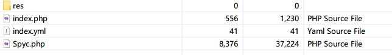
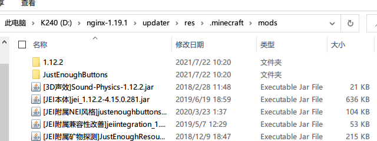
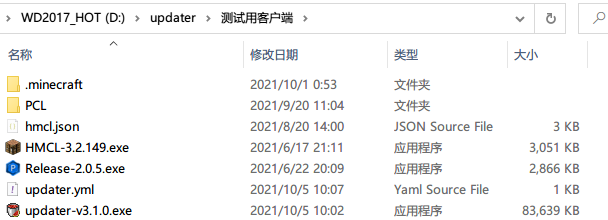
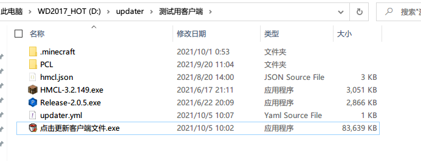

## PHP服务端

1. 把`PHP服务端`文件夹里的所有文件，解压到网站根目录（一共四个文件）



| 文件      | 用途                                       |
| --------- | ------------------------------------------ |
| res       | 存放要参与更新的文件                       |
| index.yml | 服务端配置文件（图中为`config.yml`未更正） |
| index.php | 服务端主程序文件                           |
| Spyc.php  | 服务端程序的依赖文件                       |

2. 将要更新文件，比如模组文件，复制到`res/.minecraft/mods/`里面（`.minecraft/mods/`目录请自行创建）



3. 将其它要参与更新的文件同样按上面的方法，复制到对应的目录上（比如Vexview的贴图复制到`res/.minecraft/vexview/textures/`下）
4. 编辑服务端配置文件`index.yml`，在`paths`下写上所有需要参与更新路径，默认只有一个`mods`文件夹

```yaml
# 更新模式，建议保持默认
mode: "common"
# 参与更新的路径，一行一个，可以写多个
paths:
  - .minecraft/mods
```

更多示例可以参考[这里](ServerConfigurationExamples.md)

5. 到这里，服务端配置完毕，然后是客户端

## 客户端安装

!> 在安装之前，务必备份原有客户端，以防配置出错误删文件！

1. 下载并解压客户端zip包，把主程序和配置文件一起解压到`.minecraft/updater`目录下（需要手动创建`updater/`目录）



2. 打开并配置`updater.yml`，并将`index.yml`的URL填到api选项后面

3. 如果你喜欢，可以把客户端程序，移动到启动器旁边，并且可以改成别的文件名（比如：`点击更新mods.exe`等等），但是，客户端程序只有放在以下路径才能正常工作：`.minecraft`同级目录(启动器旁)、`.minecraft/`下，`.minecraft/updater/`下



5. 到这里所有的安装工作已经结束了，开始启动测试效果吧！

### 后续维护

得益于软件的同步式更新架构，后续的客户端维护其实是非常简单的：

+ 给客户端新增文件：在服务端**添加**对应的文件，客户端那边下次启动时，就会同步更新
+ 删除客户端的文件：在服务端**删除**对应的文件，客户端那边下次启动时，就会同步更新
+ 更新客户端的文件：在服务端**替换**对应的文件，客户端那边下次启动时，就会同步更新

不仅仅是文件，文件夹也是和上面一样的更新逻辑。这样，服务端的内容，就会自动同步到客户端那边。如果没有按预期更新，请检查一下对应的文件/目录是否忘了添加更新规则。

## 高级功能

[AdvancedTopic.md](AdvancedTopic.md ':include')