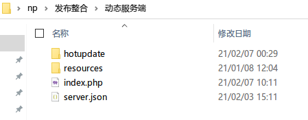
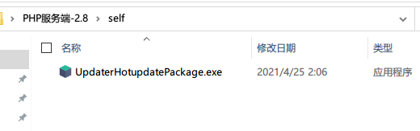
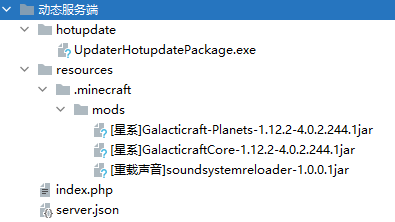
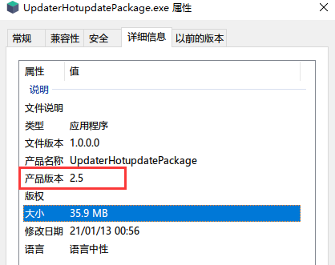

## PHP服务端安装

> 如何搭建PHP环境不在本文档的范围内，请善用搜索引擎

1. 新建一个空白文件夹，解压php服务端zip包
2. 
3. 解压热更新包，并将`UpdaterHotupdatePackage.exe`文件复制到PHP服务端的`self`目录下
4. 
5. 编辑`server.json`，参考[服务端配置文件](服务端配置文件.md ':target=_blank')
6. 将需要更新的文件放到`res`目录里（确保目录结构完整），可以参考下面的图片
7. 
8. 配置服务端配置完毕！接下来是[客户端安装教程](客户端安装教程.md)
9. 无论何时，想要查看热更新包的版本，请点击**右键->属性->详细信息->产品版本**
10. 

