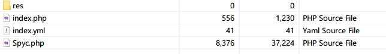
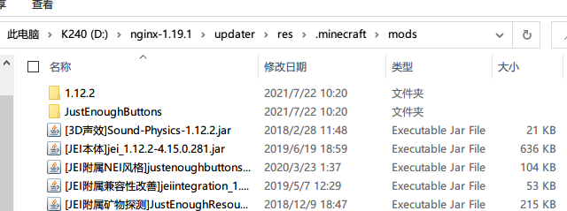

## PHP服务端安装

1. 把`PHP服务端`文件夹里的所有文件，解压到网站根目录（一共四个文件）

| 文件      | 用途                                       |
| --------- | ------------------------------------------ |
| res       | 存放要参与更新的文件                       |
| index.yml | 服务端配置文件（图中为`config.yml`未更正） |
| index.php | 服务端主程序文件                           |
| Spyc.php  | 服务端程序的依赖文件                       |

2. 将要更新文件，比如模组文件，复制到`res/.minecraft/mods/`里面（`.minecraft/mods/`目录请自行创建）

3. 将其它要参与更新的文件同样按上面的方法，复制到对应的目录上（比如Vexview的贴图复制到`res/.minecraft/vexview/textures/`下）
4. 编辑服务端配置文件`index.yml`，参考下面的[服务端配置](#服务端配置)章节进行配置
7. 到这里，服务端配置完毕了，接下来是[客户端安装教程](客户端安装教程.md)

### 后续维护

得益于软件的同步式更新架构，后续的客户端维护其实是非常简单的：

给客户端新增文件：在服务端**添加**对应的文件，客户端那边下次启动时，就会同步更新

删除客户端的文件：在服务端**删除**对应的文件，客户端那边下次启动时，就会同步更新

更新客户端的文件：在服务端**替换**对应的文件，客户端那边下次启动时，就会同步更新

不仅仅是文件，文件夹也是和上面一样的更新逻辑。这样，服务端的内容，就会自动同步到客户端那边。如果没有按预期更新，请检查一下对应的文件/目录是否忘了添加更新规则。

[服务端配置文件.md](服务端配置文件.md ':include')
