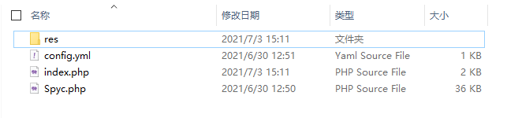

## PHP服务端安装

1. 把`php服务端`文件夹里的所有文件，解压到网站根目录（一共四个文件）

2. 

3. `res`目录存放要更新的文件、`config.yml`配置更新路径

4. `index.php`和`Spyc.php`为程序文件，不用管它

7. 编辑`index.yml`（之前是`config.yml`），请参考[这里](服务端配置文件.md ':target=_blank')

6. 将需要更新的模组文件复制到`res/.minecraft/mods`目录里（其它文件按实际路径复制就好）

7. 配置服务端配置完毕！接下来是[客户端安装教程](客户端安装教程.md)

