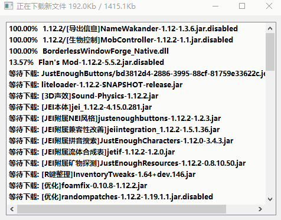

## updater——更新客户端小程序，Mod服好帮手

?> 在使用IIS HTTP 服务器时，请尽量避免文件名包含+号，否则可能会无法访问对应文件。

## 文档导航

!> 请直接点击下方链接导航到对应版本的帮助文档（各文档内已列出下载地址）

关于静态部署和动态部署的选择，请点击[这里](#不同部署方式的对比)

| 链接                                                  | 备注                |
| ----------------------------------------------------- | ------------------- |
| [食用手册-2.6](食用手册-2.6.md)                       | 测试版              |
| [食用手册-2.5](食用手册-2.5.md)                       | 稳定版              |
| [食用手册-2.4](食用手册-2.4.md)                       |                     |
| [食用手册-2.1-2.2](食用手册-2.1-2.2.md)               |                     |
| [食用手册-2.0-2.1.1](食用手册-2.0-2.1.1.md)           |                     |
| [食用手册-1.2.2](食用手册-1.2.2.md)                   | 已过时              |
| [食用手册-1.2.1](食用手册-1.2.1.md)                   | 已过时              |
| [食用手册-1.0-1.2.0](食用手册-1.0-1.2.0.md)           | 已过时              |
| [食用手册-FileSA远古版本](食用手册-FileSA远古版本.md) | 前ClientUpdater项目 |

## 开发计划

+ [ ] 隐藏客户端程序的倒计时黑框，优化PCL2启动器的体验

## 宣传文案

<!-- tabs:start -->

## **2.0版本介绍**

1. 支持静态部署，支持对象存储服务、支持CDN（静态部署方式）
2. 支持集成到启动器，一键启动游戏
3. 两种工作模式支持，A模式：指定路径更新 和 B模式：指定文件更新
2. 支持用正则表达式过滤文件或者路径
3. 依然支持热更新的特性
4. 服务端使用php开发，可以将更新源挂到网站空间上，对面服极其友好（动态部署方式）
5. exe文件打包，即使没有Jvav环境也能正常运行
8. 2.0可以在任务栏下方显示总下载进度（是按文件大小算的不是按文件数量算的哦，不会出现卡99%那种令人捉急的情况）




## **1.0版本介绍（已过时）**

特别注意：
1. 本软件是一个软件，请独立运行，不要放到plugins文件夹或者Mods文件夹
2. 本软件运行要求最低是Java8
3. 面板服通常无法使用此软件(多数情况下)，因为无法开启新的独立端口也没有主机终端可以操作，VPS则不受这个影响

<!-- tabs:end -->

## **开源地址**

<!-- tabs:start -->

### **2.0版本**

1. PHP服务端：https://github.com/updater-for-minecraft/UpdaterServer
2. 热更新包：https://github.com/updater-for-minecraft/UpdaterHotupdatePackage
3. 客户端：https://github.com/updater-for-minecraft/UpdaterLauncher
4. 对象存储部署工具：https://github.com/updater-for-minecraft/AutoDeployer
5. 目录校验文件工具：https://github.com/updater-for-minecraft/JsonGenerator

### **1.0版本（不推荐）**

1. 服务端：https://github.com/updater-for-minecraft/updater-server
2. 核心包: https://github.com/updater-for-minecraft/updater-core (核心包通常内嵌与服务端Jar之中)
3. 客户端: https://github.com/updater-for-minecraft/updater-client (只是个空壳，核心逻辑在核心包里面)
4. 规则编辑器：https://github.com/updater-for-minecraft/updater-rulesEditor

<!-- tabs:end -->

## 更新记录

<!-- tabs:start -->

### **热更新包**

> 2.4版本以前的热更新包是集成到服务端以前的，如果需要，请查阅服务端更新日志

```
2.4.7：
支持静态部署、支持集成到启动器（如HMCL），另外注意1.4版本和之前的版本协议不能互相兼容！

2.5：
支持向客户端程序报告发生的错误，在发生错误（比如网络原因）时会返回1而不是一直返回0
支持调整网站索引文件
修改了热更新包的文件名
调整了热更新包信号文件的路径（从`.minecraft/*.signal`->`.minecraft/updater/*.signal`）
调整了log文件的位置（`.minecraft/updater.log`->`.minecraft/logs/updater.log`）

2.5.1:
修复：找不到配置文件文件提示窗口显示时依赖配置文件内容的依赖问题
默认会自动创建log文件
优化了一些调试输出

2.5.2:
1. 修复删除客户端多余目录时会报错的问题

2.6alpha1:
1. 界面使用Chromium Embedded Framework驱动，HTML+JS搭建
2. 因为加载依赖的原因，服务端client.json配置文件内容整合到客户端配置文件内
3. 如果软件运行过程中出现严重错误会在工作目录生成updater.error.log文件
4. 修复运行之前不会自动清理信号文件的问题

2.6alpha2:
1. 修正了一些编译选项
2. 修正了一些错误信息的时态问题
```

### **客户端**

```
0.1b1:
1.支持文件夹
2.支持多个文件夹，可更新模组文件夹，材质包文件夹，配置文件文件夹等
3.支持md5验证，完全一样的文件就跳过，避免浪费流量
4.支持多地址，可与多个服务器互相同步
5.修改默认端口为22123
6.支持多行命令，一行一句
7.同步规则从服务端获取，避免反复更新客户端

0.1b2:
1.修改默认端口为26542
2.修复文件太多无法更新的问题
3.去除更新完成的信息框

0.1b3:
增加GUI

2.0（a0915）：
首次发布2.0版本

2.0.1（a0922）: 
修复了空格路径无法正常启动的问题

2.0.2（a1201）：
增加对b64编码过的URL的处理支持

2.0.3（b0108）：
支持集成到启动器（如HMCL）

2.1：
1.支持2.5版本热更新包
2.发生错误时会返回1而不是一直返回0
3.优化热更新包的调用逻辑

2.1.1:
1. 优化控制台输出提示文字
2. 强制退出倒计时10min -> 3min

2.1.2:
1. 优化控制台输出提示文字（增加强制退出的倒计时说明）
```

### **静态服务端**

```
2.4:
首次发布

2.5:
1. 通信协议v2.1，适配热更新包2.6版本
2. client.json整合到客户端内了
```

### **动态服务端**

```
0.1：
第一个版本发布

0.2：
修复Java7无法运行的问题

0.3：
移除以脚本来启动的机制，改为直接运行

1.0：
修改通信协议，默认端口更换为28445
修改GUI界面，显示数据更详细
添加修改窗口标题的功能
添加AfterRun机制

1.1：
添加动态执行机制
添加文件忽略机制
修改默认端口为5398
修改JRE最低要求为1.8或者更高版本
添加内置的帮助文档

1.1.1：
将loader分离成一个单独的项目
修复"忽略文件"功能无法生效的问题
修复"无法删除应该被删除的文件/文件夹"的问题

1.1.2：
优化代码，变更一些文字提示

1.1.3：
底修复了客户端文件路径中含.（尤其是.minecraft目录）时忽略文件(夹)无效的问题
美化了一些客户端显示效果

1.1.4：
修复了一些传输机制的问题和优化部分代码效率，仓库从coding移动到github

1.1.5：
修复了文件名过长会乱码的bug和修复了忽略文件功能无效的bug，并增加了找不到核心包和更新源文件夹的提示信息，下次准备增加单独针对某个文件的更新规则的支持和以正则表达式来忽略的文件机制，另外2.1版本不能和2.2版本混用

1.2.x：
修复无法更新客户端根目录的问题

2.0.1: （热更新包集成版本）
规范了客户端配置文件的命名

2.1: （热更新包集成版本）
制作了新的界面，取代了之前的终端界面，但是大小也大了不少

2.1.1：（热更新包集成版本）
修复了任务栏进度条在取消最小化后会丢失的问题

2.1.2：（热更新包集成版本）
重构了主代码逻辑，优化了一些进度的描述

2.2.0：（热更新包集成版本）
使用了新的配置文件逻辑，更加清晰明了、修复了报错信息框无法弹出来的问题

2.2.1：（热更新包集成版本）
增加对b64编码过的URL的处理支持

2.2.2：（热更新包集成版本）
修复子目录文件无法下载的问题、修复空文件夹无法创建的问题、修复无法弹出报错信息的问题、增加Content-Length缺失的情景处理、增加客户端窗口部分配置功能

2.3:
支持2.0版本热更新包

2.5:
1. 整合了一些文件，目录变得更干净了
2. 通信协议v2.1，适配热更新包2.6版本
3. client.json整合到客户端内了
```

### **小工具**

Deployer

```
1.3：
首次发布

1.4:
（测试版本未公开）

1.5.1:
1. 整合了JsonGenerator的功能
2. 重写了代码，整合了所有配置文件到config.json，不再杂乱
```

---

JsonGenerator：

1.0.1：
首次发布

<!-- tabs:end -->

## 不同部署方式的对比

### 动态部署用场景

推荐不太懂网站搭建的服主、技术适用动态部署，因为此方式相对容易配置，只需要一个PHP网站主机就可以轻松搭建

### 静态部署场景

如果条件受限无法使用动态部署，或者想部署到CDN跑满客户端带宽的服主，可以选择静态部署，通常来说CDN流量费用比网站主机更划算，带宽也更大。

[回到顶部](#updater——更新客户端小程序，Mod服好帮手)