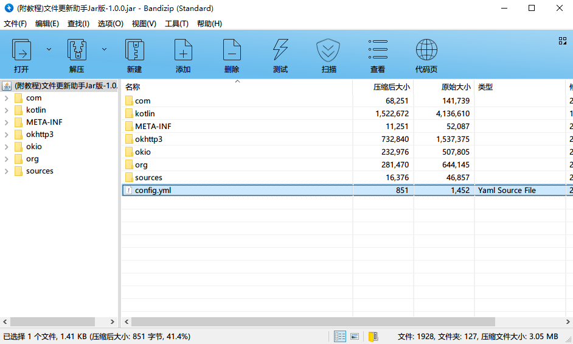

## Minecraft文件更新助手 —— Jar版

Jar版与正式版是互补的关系。用来解决一些正式版中的问题

正式版和Jar版使用相同的服务端，可以做到不改动服务端的情况下，相互兼容

Jar版本的优势：

1. Jar格式打包跨平台，32/64位系统，甚至能兼容WinXp
2. 只有核心更新功能，超小体积（5Mb左右）
3. 简单易用，适合ClientUpdater/FileSA远古项目的老用户使用习惯
4. 极低杀软误报
5. 支持配置文件内置到Jar包体里

### 环境要求

Jar运行环境要求：JRE/JDK 8 或者以上，支持Java11

### 使用方法

用压缩软件打开Jar包，把`config.yml`解压到Jar的旁边

这个`config.yml`文件就是配置文件，我们用文本编辑器打开编辑

各个配置选项的说明已经写在config.yml中了，可以阅读后调整各选项的值

除了`server`选项是必填以外，其它选项均可省略不写

编辑好配置文件后，保存关闭这个文件，双击启动Jar测试效果，注意不要设置成默认使用压缩软件打开Jar文件了，要用`javaw.exe`或者`java.exe`才能启动，正常情况下图标应该是Java的咖啡杯 ![java-icon][java-icon]

### 打包配置文件到Jar包里

当程序检测到旁边有`config.yml`时会优先加载Jar旁边的配置文件`config.yml`，如果这个文件不存在，就会去读取Jar包里面的`config.yml`，如果两个文件都不存在，就会报错了。

在调试好配置文件之后，可以用压缩软件把配置好的`config.yml`打包进Jar包里（如果提示覆盖的话记得点”是”），然后将外面的配置文件删掉，只留下Jar包里配置文件，这样看起来会整洁许多，也不会影响到程序的读取

### 常见问题

#### 配置文件读取失败

检查配置文件文件中server选项是否存在，是否拼写错误，以及是否一个字符串

#### 找不到配置文件

检查Jar包内是否有config.yml文件存在，或者检查Jar文件旁是否存在config.yml，当这两个文件都不存在时，就会出现找不到配置文件的错误了

#### 连接关闭

此错误不是程序的bug，请检查网络问题，当文件下载到一半时如果网络闪断，会弹出这个提示框。

检查方法：请将config.yml里server所填写的地址复制粘贴到浏览器，看能否正常打开

#### 服务器未能响应正确的数据

此错误通常为服务端返回4xx引起，请将config.yml中的server所填写的地址复制粘贴到浏览器打开，如果不能打开，请自行检查服务端设置。

#### 数据无法解码

请将config.yml里server所填写的地址复制粘贴到浏览器打开，如果不是弹出下载或者显示yml格式文本，那么请根据具体信息自行解决问题

#### 找不到.minecraft目录

请将本软件放置到.minecraft目录旁边，或者在配置文件config.yml里手动指定一个更新起始路径

[java-icon]:data:image/jpeg;base64,iVBORw0KGgoAAAANSUhEUgAAABAAAAAQCAYAAAAf8/9hAAAACXBIWXMAAAsTAAALEwEAmpwYAAAF42lUWHRYTUw6Y29tLmFkb2JlLnhtcAAAAAAAPD94cGFja2V0IGJlZ2luPSLvu78iIGlkPSJXNU0wTXBDZWhpSHpyZVN6TlRjemtjOWQiPz4gPHg6eG1wbWV0YSB4bWxuczp4PSJhZG9iZTpuczptZXRhLyIgeDp4bXB0az0iQWRvYmUgWE1QIENvcmUgNi4wLWMwMDIgNzkuMTY0MzUyLCAyMDIwLzAxLzMwLTE1OjUwOjM4ICAgICAgICAiPiA8cmRmOlJERiB4bWxuczpyZGY9Imh0dHA6Ly93d3cudzMub3JnLzE5OTkvMDIvMjItcmRmLXN5bnRheC1ucyMiPiA8cmRmOkRlc2NyaXB0aW9uIHJkZjphYm91dD0iIiB4bWxuczp4bXA9Imh0dHA6Ly9ucy5hZG9iZS5jb20veGFwLzEuMC8iIHhtbG5zOmRjPSJodHRwOi8vcHVybC5vcmcvZGMvZWxlbWVudHMvMS4xLyIgeG1sbnM6cGhvdG9zaG9wPSJodHRwOi8vbnMuYWRvYmUuY29tL3Bob3Rvc2hvcC8xLjAvIiB4bWxuczp4bXBNTT0iaHR0cDovL25zLmFkb2JlLmNvbS94YXAvMS4wL21tLyIgeG1sbnM6c3RFdnQ9Imh0dHA6Ly9ucy5hZG9iZS5jb20veGFwLzEuMC9zVHlwZS9SZXNvdXJjZUV2ZW50IyIgeG1wOkNyZWF0b3JUb29sPSJBZG9iZSBQaG90b3Nob3AgMjEuMSAoV2luZG93cykiIHhtcDpDcmVhdGVEYXRlPSIyMDIxLTEwLTA4VDEzOjExOjE4KzA4OjAwIiB4bXA6TW9kaWZ5RGF0ZT0iMjAyMS0xMC0wOFQxMzoxOTo1MSswODowMCIgeG1wOk1ldGFkYXRhRGF0ZT0iMjAyMS0xMC0wOFQxMzoxOTo1MSswODowMCIgZGM6Zm9ybWF0PSJpbWFnZS9wbmciIHBob3Rvc2hvcDpDb2xvck1vZGU9IjMiIHBob3Rvc2hvcDpJQ0NQcm9maWxlPSJzUkdCIElFQzYxOTY2LTIuMSIgeG1wTU06SW5zdGFuY2VJRD0ieG1wLmlpZDozYTY5YWViNy1jMjgxLWVhNDgtOWViMC1jOTJhNTRkODM2OTMiIHhtcE1NOkRvY3VtZW50SUQ9InhtcC5kaWQ6NGZkMjBmMzMtZGFhNC0xMjQ3LWE1N2QtYTI1ZGQ0ZGJlMTEzIiB4bXBNTTpPcmlnaW5hbERvY3VtZW50SUQ9InhtcC5kaWQ6NGZkMjBmMzMtZGFhNC0xMjQ3LWE1N2QtYTI1ZGQ0ZGJlMTEzIj4gPHhtcE1NOkhpc3Rvcnk+IDxyZGY6U2VxPiA8cmRmOmxpIHN0RXZ0OmFjdGlvbj0iY3JlYXRlZCIgc3RFdnQ6aW5zdGFuY2VJRD0ieG1wLmlpZDo0ZmQyMGYzMy1kYWE0LTEyNDctYTU3ZC1hMjVkZDRkYmUxMTMiIHN0RXZ0OndoZW49IjIwMjEtMTAtMDhUMTM6MTE6MTgrMDg6MDAiIHN0RXZ0OnNvZnR3YXJlQWdlbnQ9IkFkb2JlIFBob3Rvc2hvcCAyMS4xIChXaW5kb3dzKSIvPiA8cmRmOmxpIHN0RXZ0OmFjdGlvbj0ic2F2ZWQiIHN0RXZ0Omluc3RhbmNlSUQ9InhtcC5paWQ6M2E2OWFlYjctYzI4MS1lYTQ4LTllYjAtYzkyYTU0ZDgzNjkzIiBzdEV2dDp3aGVuPSIyMDIxLTEwLTA4VDEzOjE5OjUxKzA4OjAwIiBzdEV2dDpzb2Z0d2FyZUFnZW50PSJBZG9iZSBQaG90b3Nob3AgMjEuMSAoV2luZG93cykiIHN0RXZ0OmNoYW5nZWQ9Ii8iLz4gPC9yZGY6U2VxPiA8L3htcE1NOkhpc3Rvcnk+IDwvcmRmOkRlc2NyaXB0aW9uPiA8L3JkZjpSREY+IDwveDp4bXBtZXRhPiA8P3hwYWNrZXQgZW5kPSJyIj8+xy6+mwAAAsFJREFUOI11kc9rXFUUxz/3zvsx8zKTTFJnoiVjxdJQ2xgwUiGgaO0uii66cNG1qy7EbTcuBNcu1H9BEQRBFOrGhajFxo1pKVgmptU0Q2Yy8zK/3pv37r3HRZuSUTzw3Rw+58D5HJWmk2YYBjUg439KJgOUH4EuHG8Hxpg2IuKcc/LvWGtFRCQ/3JPDr6+JiIgTEWftY0ZEnDbGdK21TMUY0BqA/hfv4z29htgcO0lxwmPOGNPVzjmmYi34Pi4b0fnkbXT9NIJmtPklDouDKf4/C8TzsOmQg4/fQM03UNUlJs1fKKxsIH4Jm2dTvGetPWZLKBSLjK9/igrKBKtvMvrmQxau/YQxYMZDUGpKsBYRjuLEYR14S8+jn2jgxGGaN0mamzglKAXq0QlHM/pISJblRGHAjAZvdQO9eBbtFSidfxX59gPCgiLNcqKST7kUkuU51lq8PM9RShEVQ25v73Jj6w9Wlp9l5ZWrSO8eZu0KPVVhsN/l790WW3fv8/pL5zhZW2CcpA8dKKUoeJq7f+3x660dFioz9AYJk9zihy9idZG55g4X19f4/PoNdvbafPTeFQbDEZ5zDoDOQczlSxdYnJ/lu59/59ypp3AoDBrtctbXV/lxc4vqbMQ7ly7Qj2Ps8TeKgM1yatUy5VJIbiylsICZJGil6PaHxP0h7771MsuNOnF/hDiH9/B7QrVS4kGnR+B5LM7PsR8PcSK04wFnTz3JcqPOc8vPEB90ud/qUAwDAFSr1epUy6UTn331A9/fvMPVyxc506hz+88HjJOMYuBzolqmUgrZ3m0zSjM21s+jtcY6OVBx3HNaoX67c49b23sM0xRjLHPlCE9rcmOJhwm5tSzV53nthTOcrFVJ0owg8EXt77ebYRjUZitRhvJIxkMOBym5MaAUCvD9ApWoSDQTYbIJ/dGEwPeCJE3b/wCJ+8v1a6/lFwAAAABJRU5ErkJggg==

