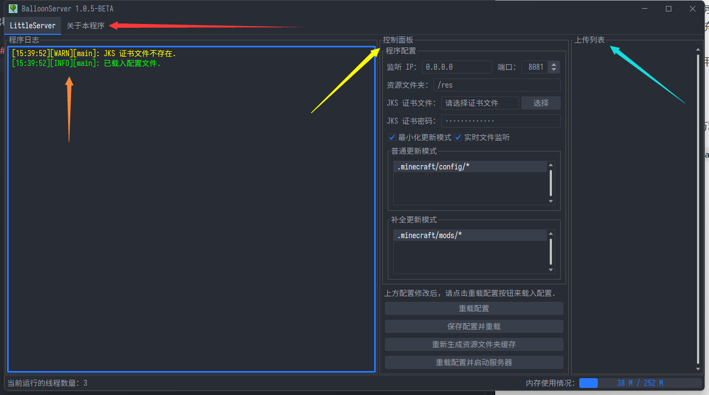

## BalloonServer 服务端 Manual
BalloonServer 是由[KasumiNova](https://github.com/KasumiNova)大佬制作的一个完全图形化的单文件服务端，底层基于高性能的 Netty-IO，性能更佳。

[点击这里](balloon-server-reference.md)跳转到 BalloonServer 服务端的参考页面，了解更多用法和技术细节

## 优点
- 99.9% 可视化操作，上手简单便捷
- 开箱即用，无需手动编辑配置文件
- 支持双击启动和 Shell 启动
- 支持配置重载
- 支持 SSL 证书
- 支持实时文件监听，实现全自动服务端维护
- 支持最小化到任务栏托盘（需要系统支持）
- 支持跨平台（Linux, Windows, MacOS）
- 无处不在的多线程处理，最大化利用服务器资源，减少卡顿
## 窗口介绍

控制面板将会是你后期最经常接触的面板，每个部分都有不同的功能：

- 橙色箭头所指的为程序日志，这里将输出程序的普通日志
- 红色箭头所指的为标签页窗口
- 黄色箭头所指的为控制面板，用于控制服务器 启动/关闭，以及配置服务器
- 蓝色箭头所指的为上传列表，当玩家向服务器获取文件时，会在此处显示传输进度

***提示：如果操作系统支持系统托盘，则关闭窗口的时候不会关闭程序，而是会最小化到任务栏。***
***左击托盘图标即可打开程序，右击托盘图标可打开菜单以退出程序。***

## 使用教程
1. 下载**单文件图形化增强**目录内的Jar文件（无特殊需求选择最新版即可）并放到一个新建的文件夹里，这个文件夹可以放到任意位置（建议使用纯英文路径）
2. 双击 JAR 文件或执行命令 `java -jar BalloonServer-1.x.x-BETA.jar` 启动程序
3. 待软件启动后，就可以看到主窗口了
4. 在JAR文件的旁边新建一个目录，叫`res`
5. 如果你要更新模组文件，复制Minecraft客户端中所有的模组文件到`res/.minecraft/mods/`里（目录请自行创建），注意是所有文件。如果你要更新其它文件，同样按上面的方法，复制到`res`目录里对应的路径的目录上（比如vexview的贴图复制到`res/.minecraft/vexview/textures/`下，其它文件同理）
6. 然后在右侧`控制面板`->`普通更新模式`的列表中点击右键`添加更新规则`，更新规则就是一个路径+通配符，表示哪些需要更新`res`目录下的哪些文件。比如要更新模组文件和vexview的贴图文件可以添加这两条规则，更新其它文件可以模仿这个照葫芦画瓢：
   1. `.minecraft/mods/*.jar`
   2. `.minecraft/vexview/textures/**`

7. 需要注意的是，路径分隔符只能使用正斜线（即使是在Windows上），且避免在更新规则中包含`[]`方括号，会导致更新失败（[更新规则示例、参考链接](filter-rules-reference.md)）
8. 其它参数无需改动，保持默认即可
9. 点击`控制面板`下方的`保存配置并重置`按钮，然后再点击`重载配置并启动服务器`按钮即可启动服务器。如果你看到`服务器已启动，地址：0.0.0.0:8080`的字样，说明启动成功。如果启动失败请换个端口再试试
10. 复制程序输出的`API地址`后面的链接，到浏览器粘贴并打开，如果显示大串`json`格式的英文（不是json格式就是有问题），那么恭喜，服务端配置无误！
11. 若你有外网IP或者域名，请将链接中的`0.0.0.0`替换为对应的外网IP域名再访问一次，再次确认无误后，安装过程就结束了。

## 文件管理

得益于软件的同步式更新架构，后续对客户端的文件管理其实是非常简单的：

+ 给客户端新增文件：在服务端**添加**对应的文件，客户端那边下次启动时，就会同步更新（开启`实时文件监听`时可以即时生效）
+ 删除客户端的文件：在服务端**删除**对应的文件，客户端那边下次启动时，就会同步更新（开启`实时文件监听`时可以即时生效）
+ 更新客户端的文件：在服务端**替换**对应的文件，客户端那边下次启动时，就会同步更新（开启`实时文件监听`时可以即时生效）

不仅仅是文件，文件夹也是和上面一样的更新逻辑。这样，服务端的内容，就会自动同步到客户端那边。如果没有按预期更新，请检查一下对应的文件/目录是否忘了添加更新规则

## 配置SSL证书

配置好SSL证书之后，BalloonServer的服务协议会从监听http请求转变为监听https请求。

配置过程很简单，点击`控制面板`中`JKS证书文件`后面的`选择按钮`选择你的SSL证书文件（格式必须为Java的JKS格式），然后`JKS证书密码`中输入证书文件的密钥，然后保存配置并重启服务器即可生效

## 控制面板按钮
### 重载配置

点击后，服务端会将当前的程序配置应用到程序内，但是不会应用到服务器内。

### 保存配置并重载
点击后，服务端会将当前的程序配置应用到程序内，并保存当前的配置文件至磁盘，但是不会应用到服务器内。

### 重新生成资源文件夹缓存
点击后，服务端会主动生成资源文件夹的缓存，并保存至磁盘。并且会重载服务器的资源文件夹缓存。
***即使服务器正在运行，程序也可以重载服务器的缓存***

### 重载配置并启动服务器
点击后，服务端会将当前的程序配置应用到程序内，并应用到服务器内，然后生成资源文件夹缓存，最后启动服务器。如果启用了 `实时文件监听` 功能，程序还会启动实时文件监听器。

### 关闭服务器
点击后，服务端将会在完成最后任务后停止监听端口，如果启用了 `实时文件监听` 功能，程序也会关闭实时文件监听器。

*Enjoy it~*