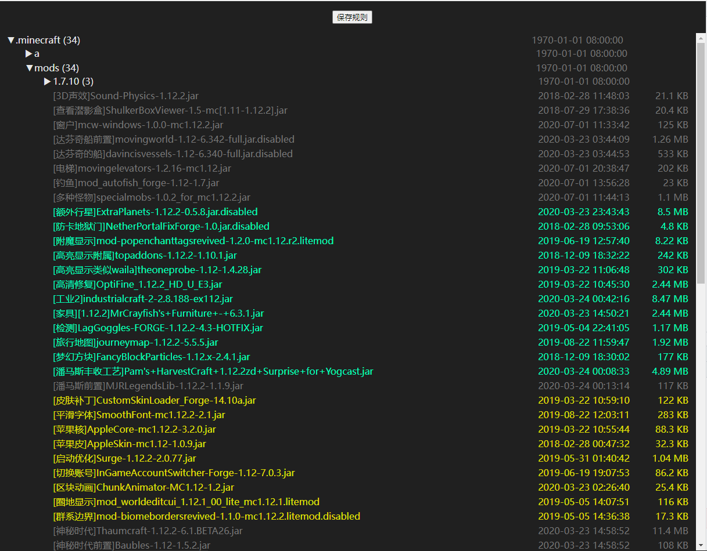

## 更新规则编辑器 Manual

**更新规则编辑器**目前支持所有服务端：单文件服务端、静态服务端、BalloonServer

**更新规则编辑器**是一个独立的小工具，可以以鼠标点击的方式代替编写简单的更新规则。并以颜色标记的方式清晰明了地显示出哪些文件需要更新哪些文件被忽略不更新。

更新规则编辑器只能生成很简单的更新规则，并不适用于所有情况。一些复杂的更新规则仍然需要亲自编写。不要过度依赖编辑器，有条件的用户请尽量手写更新规则。

## 已知问题

简短版本：

如果一个文件你发布新版本之后，新版和旧版本文件名有任何变化，请勿删除旧文件名的更新规则，即使是无效的规则也要保留，永远不能删除。以避免客户端同时出现新旧两个版本文件导致冲突

详细版本：

确保文件更新前后都使用同一个文件名，如果文件名有变化（尤其是升级mod版本的时候），新文件默认是忽略更新状态的，而旧文件会成为一条无效更新规则。

此时我们通常的做法是把新文件加入更新规则，然后把旧文件的更新规则删掉。

请注意千万不要这样操作，因为无效的更新并非真的无效，而仅仅是更新规则存，但找不到对应的文件而已。

如果你这样操作，会导致旧文件被设置为了忽略更新，无法从客户端删除，而新文件又会被下载。然后就出现了新旧版本共存的问题，如果是模组文件，一定会加载冲突！

正确的做法是：将新文件标记为需要更新，然后不要删除旧的文件更新规则。

这可能有会有一个问题，就是旧规则会越来越多，列表会越来越占空间。这个问题无解，也是使用编辑器的弊端。最理想的方式是不使用编辑器，而是手写更新规则，并参考更新规则实例里面的“允许玩家添加自己的Mod”章节去编写更新规则，这样可以一劳永逸

如果要更新的文件前后文件名并没有发生变化，就不会出现上面的问题。所以规则编辑器适合用来更新文件名不会发生变化的文件，如果文件名会发生变化，比如模组文件名新版本通常就和旧版本不一样，那么是不推荐使用规则编辑器的

## 使用教程

0. 在使用规则编辑器之前，可以不用清空现有规则，这些规则会以**无效规则**显示在编辑器中，注意不是真的是无效的，只是编辑器无法识别而已，千万不要看都不看就给删掉了！确定不需要再删除！
1. 将 "规则编辑器" 文件夹复制到
    1. a.单文件服务端根目录下（LittleServer.jar 旁）
    2. b.或者静态服务端的根目录下（run.bat 旁）
    3. c.或者BalloonServer的根目录下（BalloonServer.exe 旁）注意编辑规则期间请完全退出BalloonServer否则不会生效
2. 根据不同的服务端变体，双击对应的 `启动规则编辑器.cmd` 文件来启动编辑器
3. 规则编辑器启动成功会输出两个链接，并会自动打开你的浏览器
    如果浏览器没有自动打开，请随意复制其中一个链接到浏览器里手动打开
4. 点击文件夹可以展示里面的文件。文件夹后面括号里的数字表示文件夹下的更新规则数量
5. 点击文件可以标记为需要更新或者忽略更新
    将需要更新的文件标记为"普通"更新模式，或者"补全"更新模式即可
    将需要忽略的文件标记为"忽略"（默认所有文件都是忽略状态）
6. 无效的更新规则会显示在文件的最下方，无效的更新规则并非是真的无效，而是编辑器本身无法直接识别而已，比如带有通配符或者使用了一些正则的高级语法的规则都是无法直接识别的。还有一种可能是文件在更新规则里存在，但实际文件已被删除。无效的更新规则请按需要删除（鼠标悬浮上去可以显示完整的规则）
7. 所有标记完成后，点击上方的"保存规则"即可保存。如果想丢弃更改，按F5刷新页面即可
8. 更新规则修改完成后，可以直接关闭黑色窗口来退出规则编辑器，然后关闭浏览器页面
    1. 如果是单文件服务端，重新启动单文件服务端程序
    2. 如果是静态服务端，重新运行 run.bat 上传
    3. 如果是BalloonServer，注意编辑规则期间请完全退出BalloonServer否则不会生效。编辑完成后再次启动BalloonServer程序

## 常见问题

Q:服务端目录下找不到res目录
A:规则编辑器未放置到正确的位置上，请参考教程重新复制一次。同时请检查是否运行了错误的启动脚本（服务端类型选错了）

Q:Address already in use: JVM_Bind
A:端口冲突，请检查是否同时打开了两个规则编辑器。如果不是请确保6700端口可用
