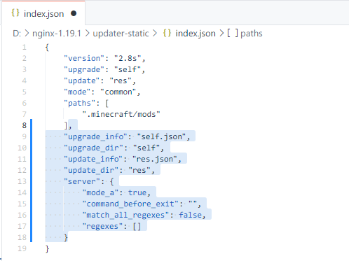
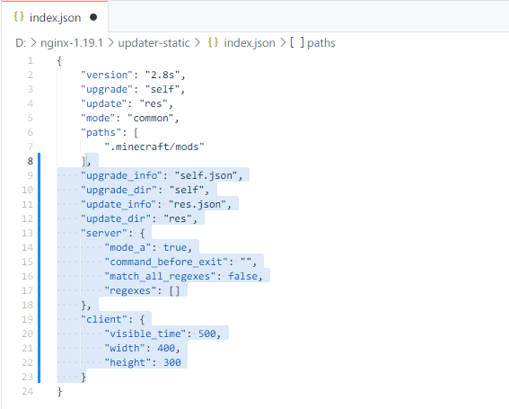
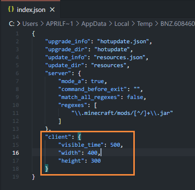

# 从旧版本升级

!> 在升级线上的版本之前，务必先进行测试，确认无误后再同步到线上服务器

updater支持自身热升级，可以在每次启动时自动升级到服务端内的最新版本

具体升级步骤：

1. 下载新版热更新包，并解压覆盖掉服务端`self`目录内的同名文件
2. 如果需要，请重新编辑服务端配置文件
3. 如果需要，请重新生成校验文件，PHP服务端可跳过此步骤
4. 上传到服务器，客户端会自动跟进到新版本

---

因Windows系统限制，无法对**updater客户端程序**`UpdaterClient-x.x.exe`文件自身进行升级（无法删除运行中的文件）

只能以重新发布完整MC客户端压缩包的形式来更新这个文件，除非必要，否则不建议升级这个文件

## 从以前的版本升级到v2.8

v2.8没有添加新的功能，此次更新主要是简化配置难度，方便新人入坑

<!-- tabs:start -->

### **.**

请点击右上方对应版本的升级指南↗

### **从v2.6、v2.7**

PHP服务端直接替换成新的版本就好了，不用做任何额外的操作，PHP代码会帮你保证向前的兼容性

静态服务端需要在`index.json`添加额外的代码用于兼容v2.6、v2.7客户端

只需要添加进去就好了，并不需要修改`regexes`等字段

```json
"upgrade_info": "self.json",
"upgrade_dir": "self",
"update_info": "res.json",
"update_dir": "res",
"server": {
    "mode_a": true,
    "command_before_exit": "",
    "match_all_regexes": false,
    "regexes": []
}
```



### **从v2.5**

PHP服务端直接替换成新的版本就好了，不用做任何额外的操作，PHP代码会帮你保证向前的兼容性

静态服务端需要在`index.json`添加额外的代码用于兼容v2.5、v2.6、v2.7客户端

```json
"upgrade_info": "self.json",
"upgrade_dir": "self",
"update_info": "res.json",
"update_dir": "res",
"server": {
    "mode_a": true,
    "command_before_exit": "",
    "match_all_regexes": false,
    "regexes": []
},
"client": {
    "visible_time": 100,
    "width": 400,
    "height": 300
}
```



<!-- tabs:end -->

## 从v2.5升级到v2.6、v2.7

由于通信协议不同，从v2.5升级到v2.6、v2.7版本的方法较为特殊

<!-- tabs:start -->

### **.**

请点击右上方对应版本的升级指南↗

### **静态服务端2.4**

在升级到新版本时，配置文件`index.json`中需要保留`client`部分用于兼容2.5客户端不能删除掉（否则2.5客户端会报错），这个`client`设置参数只对2.5版本客户端起效，如果要对2.6起效的话，请在`updater.settings.json`文件中进行配置



### **PHP服务端2.3**

如果是PHP服务端请不要升级，新版客户端可以兼容老版本2.3的PHP服务端，只是`client.json`文件中的设置参数只对2.5版本客户端起效，如果要对2.6起效的话，请在`updater.settings.json`文件中进行配置

<!-- tabs:end -->