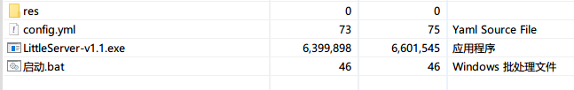
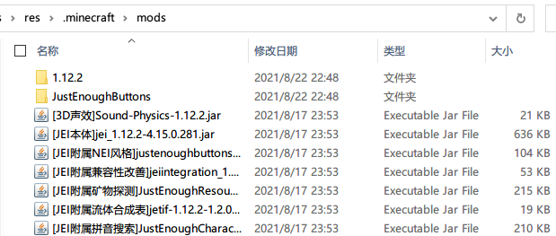

## 单文件服务端安装

1. 把整个`单文件服务端`文件夹解压到桌面上（或者其它任何地方）



| 文件             | 用途                                   |
| ---------------- | -------------------------------------- |
| res              | 存放要参与更新的文件                   |
| config.yml       | 服务端配置文件                         |
| LittleServer.exe | 服务端主程序文件                       |
| 启动.bat         | 启动服务端主程序的脚本（推荐这样启动） |

2. 将要更新文件，比如模组文件，复制到`res/.minecraft/mods/`里面（`.minecraft/mods/`目录请自行创建）



3. 将其它要参与更新的文件同样按上面的方法，复制到对应的目录上（比如Vexview的贴图复制到`res/.minecraft/vexview/textures/`下）
4. 编辑服务端配置文件`config.yml`，参考下面的[服务端配置](#服务端配置)章节进行配置
5. 到这里，服务端配置完毕了，接下来是[客户端安装教程](客户端安装教程.md)

### 配置文件说明

配置文件分两部分：

```yaml
address: 127.0.0.1
port: 8850

mode: common
paths:
  - .minecraft/mods
```

`address`和`port`是单文件服务端独有的配置项，分别表示服务端监听的IP和端口，IP通常为127.0.0.1，如果端口有冲突，请修改成其它的端口。

下面的部分，则是所有服务端通用的配置（单文件服务端也是服务端的一种），请参考下面的[服务端配置](#服务端配置)章节进行配置

### 后续维护

得益于软件的同步式更新架构，后续的客户端维护其实是非常简单的：

给客户端新增文件：在服务端**添加**对应的文件，客户端那边下次启动时，就会同步更新（即时生效，不用重启程序）

删除客户端的文件：在服务端**删除**对应的文件，客户端那边下次启动时，就会同步更新（即时生效，不用重启程序）

更新客户端的文件：在服务端**替换**对应的文件，客户端那边下次启动时，就会同步更新（即时生效，不用重启程序）

不仅仅是文件，文件夹也是和上面一样的更新逻辑。这样，服务端的内容，就会自动同步到客户端那边。如果没有按预期更新，请检查一下对应的文件/目录是否忘了添加更新规则。

[服务端配置文件.md](服务端配置文件.md ':include')