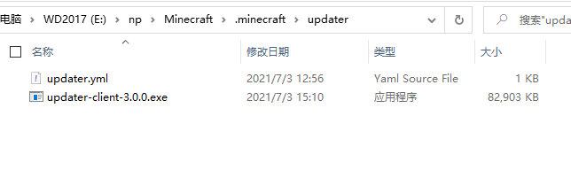
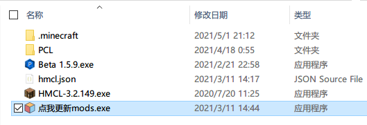
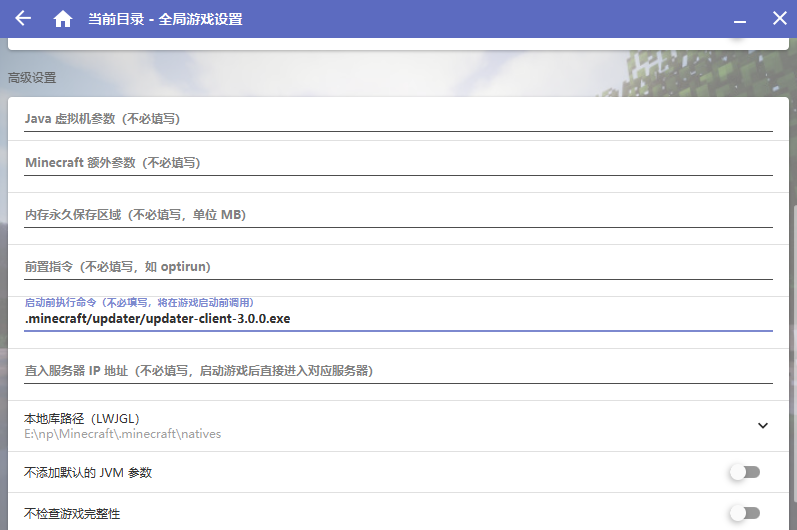

## 客户端安装教程

1. 下载并解压客户端zip包，把主程序和配置文件一起解压到`.minecraft/updater`目录下（需要手动创建`updater/`目录）
2. 
3. 打开并配置`updater.yml`（参考[这里](#配置文件)）
4. 如果你喜欢，可以把客户端程序，移动到启动器旁边，并且可以改成别的文件名（比如：`点击更新mods.exe`等等）
5. 
6. 配置完毕，启动测试吧

---

 如果你的启动器支持**启动前指令**（如HMCL），可以参考[这里](#配置一键启动)，配置一键启动！可以在**启动游戏之前更新文件**，游玩体验大幅提升

如果你的启动器不支持，请考虑使用`postcalled_command`选项，在更新完毕后，由updater来打开启动器

如果你使用PCL2，可以使用自定义界面的功能，在右侧增加一个"点击更新"的按钮，点击后，手动更新文件

## 配置文件

配置文件里除了`api`以外，其它都是可选项。

极其不建议直接复制下面的配置文件（仅供参考之用途）！

```yaml
# updater服务端的地址，支持子目录，
# 末尾必须明确地以某个文件结尾，比如index.php, index.yml
# 如果只写域名/ip的话会报错，比如这样： http://mydomain.domain/
api: http://127.0.0.1:7750/index.php

# 自定义界面的加载路径，一般是一个相对地址（起始路径: .minecraft/updater）
# 此项必须要指向一个.html文件，比如: assets: 'custom-ui/index.html'
assets: custom-ui/index.html

# 是否自动打开devtools（通常做自定义界面会用到）
# 手动打开方式：Ctrl+Shift+I
dev_tools: true

# 界面/窗口的宽度
window_width: 380

# 界面/窗口的高度
window_height: 130

# 更新完成后，updater退出之前执行的指令
# 可以用来打开启动器等
# 高阶的用法请参考Windows的cmd命令
postcalled_command: start https://www.mcbbs.net

# 报错时（网络问题、配置文件等问题出现时），屏幕上显示的自定义错误信息
# 可引导玩家前往官网或者加群
error_message: '是否需要打开服务器官网下载完整客户端?'

# 报错时，当点击屏幕上显示的自定义错误信息下面 确定按钮 后，执行的指令
# 可直接打开某个链接或者执行某个程序
# 只有当error_message存在时error_help才有效
error_help: start https://www.mcbbs.net

# 设置了更新完毕后，窗口延迟多少ms退出
visible_time:  1500

# 文件更新完毕后是否显示一个按钮手动退出（默认是自动退出）
# 在开发/调试界面时非常有用。
hold_ui: true
```

## 配置一键启动

一键启动的效果：点击启动游戏按钮，自动弹出更新，更新完毕后，接着自动启动minecraft，玩家只需要点击启动就好了，不需要进行任何其它额外操作。

>  受未知的原因限制，hmcl需要借助三方软件的帮助才能正常启动，点击[这里](assets/RunHiddenConsole.zip)获取，并将这个文件放到`.minecraft/updater/`

具体步骤：

0. 我们需要设置**启动前指令**
1. 启动HMCL，打开**（全局）游戏设置**界面，找到**启动前指令**这一项，填写`.minecraft/updater/updater-client-3.0.1.exe`，或者其它对应的路径（如果不再这里的话）
2. 如果是hmcl，则上一步里需要填写`.minecraft/updater/RunHiddenConsole.exe /w updater-client-3.0.1.exe`，且只能将`updater-client-3.0.1.exe`放到`.minecraft/updater/`里。
3. 