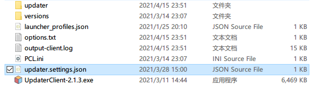

# 客户端安装教程

1. 下载updater客户端zip包并将zip包里面的文件解压至`.minecraft`目录下
2. （对于之前的老用户：客户端配置文件已从客户端zip包内移动到热更新包里面了）
4. 在`.minecraft`文件夹下创建一个叫`updater`的目录
5. 
6. 下载热更新包，并将`UpdaterHotupdatePackage.exe`文件解压到放到刚刚创建好的`updater`目录里
7. 
8. 再将热更新包里面的`updater.settings.json`解压到上级的`.minecraft`目录里
9. 
10. 修改`updater.settings.json`（参考下方配置文件介绍）
10. 如果需要，也可以把客户端程序，从`.minecraft`下移动至启动器旁边，并且可以改成别的文件名（比如：`点击更新mods.exe`等等），不会影响程序的正常运行
11. 
12. 配置完毕，启动测试吧

---

 如果你的启动器支持**启动前指令**（如HMCL），可以参考[这里](#跟随启动)，将其配置成在**启动游戏之前更新文件**，这样游戏体验将大幅提升

如果你的启动器不支持，请考虑使用`command_before_exit`主动唤起启动器

# 客户端配置文件

客户端配置文件`updater.settings.json`

```json
{
    "url": "http://127.0.0.1:7750",
    "postcalled_command": "start https://www.mcbbs.net",
    "error_message": "是否需要打开服务器官网下载完整客户端?",
    "error_help": "start https://www.baidu.com",
}
```

## url

服务器url路径，可以设置为子目录，但需要去掉结尾的`/`符号，直接在浏览器访问会出现大串大串的json文字，这代表正常工作

（url支持base64编码，如果填写了b64代码，会自动尝试解码）

## postcalled_command

（可选参数）这个命令会在所有更新完毕后，updater退出之前被执行，默认留空表示不启用这个功能，可以用来在更新完毕后打开启动器

如果需要更高阶的用法，请参考Windows的shell命令

## visible_time

（可选参数）设置了更新完毕后延迟多少ms退出，不建议太长，一般500或者500以下就好

## width

（可选参数，默认380）更新时的窗口宽度，这个看个人喜好啦

## height

（可选参数，默认130）更新时的窗口高度，这个看个人喜好啦

## parallel

（可选参数，默认为1）最大同时下载的文件数，建议不超过64

## error_message

（可选参数，需要和error_help搭配使用）当Updater报错时（比如网络问题、配置文件等问题出现时），是否会弹出一个自定义消息提示框，可以用以引导玩家前往官网下载完整的Zip包

## error_help

（可选参数，需要和error_message搭配使用）当玩家点击确定的时候，执行的命令，默认打开百度，可以根据自己的需要进行修改

## index

（特殊可选参数）当使用静态服务端时，可能需要设置此参数，一般设置为`"index": "index.json"`即可，确保指向网站索引文件名

使用PHP服务端时不需要指定此参数

## cef_with_httpserver

（高级可选参数，默认true）是否以http_server方式加载内部web资源文件

如果是就以`http://localhost:xxxx/index.html`方式加载

如果否就以`D:/Desktop/xxx/xxx/index.html`方式加载

## chunk_size

（高级可选参数）手动下载文件时分包的大小，用于进一步调优文件下载性能，单位Kb（千字节）

场景1：如果更新的文件数量比较少且文件体积比较大（10~100mb）可以设置为65536(64k)到1048576（1m）之间，如果文件更大，建议设置为多数文件大小的1/10到1/20

场景2：如果更新的文件数量较多且每个文件体积很小，可以设置为8192(8k)到32768(32k)之间

如果没有填写此参数，或者此参数小于等于0，Updater会根据文件大小自动决定合适的分包大小（推荐让Updater自动决定）

## hold_ui

（高级可选参数，默认false）文件更新完毕后是否显示一个按钮手动退出（默认是自动退出），在调试界面时非常有用。

## interface

（高级可选参数）用外部URL来代替内部的界面资源（但如果遇到网络问题可能会无法正常显示界面）。

此功能是自定义界面功能的一部分，自定义界面大多都是将web文件放在热更新包旁边，但使用此功能可以直接加载远程URL作为界面资源，对界面资源修改频繁的服来说特别有用。


# 跟随启动

设置好后直接打开启动器，点击启动游戏按钮，然后就不用管任何事情了，在真正启动游戏之前会弹出更新窗口，更新完毕立即进入游戏。

具体步骤：

0. 我们需要设置**启动前指令**，以HMCL为例
1. 启动HMCL，打开**（全局）游戏设置**界面，找到**启动前指令**这一项，填写`.minecraft/UpdaterClient-2.1.1.exe`，如果客户端程序不再`.minecraft`里而是在启动器旁边，那么直接改成`UpdaterClient-2.1.1.exe`或者`点我更新文件.exe`填到**启动前指令**里就好啦
2. （下面的配图应该是2.1.1，但是我懒得更新了，大家明白就好）
3. 
4. 重启HMCL，配置完成，可以直接点击启动游戏测试实际效果