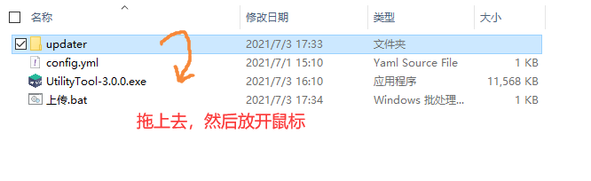

# 小工具使用教程

目前支持以下服务商的一键上传功能

+ 阿里云对象存储（推荐）
+ 腾讯云对象存储（推荐）
+ FTP/SFTP

!> 注意：无论使用什么方式上传，请务必在上传之前备份所有现有的文件

## 使用方法

1. 编辑配置文件`config.yml`，然后保存退出
2. 将`updater`目录拖到小工具上松开，开始上传
3. 或者直接双击`上传.bat`，也可以上传
4. 上传完成后，直接关掉窗口就可以
5. 

## 配置文件

```yaml
# 腾讯云请填写tencent
# 阿里云请填写aliyun
# FTP/SFTP请填写ftp
service_provider: tencent

# 腾讯云需要填写此部分
tencent:
  # 桶名
  bucket: 
  # 访问秘钥的id
  secret_id: 
  # 访问秘钥的key
  secret_key: 
  # 桶的地域
  region: ap-nanjing
  
# 阿里云需要填写此部分
aliyun:
  # 桶名
  bucket: 
  # 访问秘钥的id
  access_id: 
  # 访问秘钥的key
  access_key: 
  # 桶的地域
  region: oss-cn-chengdu.aliyuncs.com

# FTP/SFTP需要填写此部分
ftp:
  host: 127.0.0.1
  port: 21
  user: ab
  password: ab
  # 上传到哪个路径，支持子目录，默认根目录，必须以/结尾
  base_path: /
  # 时区偏移，仅在服务器返回的时区不正确时使用
  # 如果一直出现增量上传失效请尝试设置为8（中国为东八区）
  timezone_offset: 8
  # 启用TLS加密（SFTP）
  secure: true
  # 高级参数，登录后是否立即发送prot_p命令
  prot_p: false
```

>  如果是部署到对象存储服务，建议将桶的权限设置为**公共读**！

<!-- tabs:start -->

## **FTP/SFTP使用限制**

1. 因为一些原因，**SFTP模式下**无法校验服务端证书

2. 因FTP协议限制，每次上传完成后会建立缓存文件`ftp.cache.json`，借此机制可以实现文件差异的快速对比，进而可以使用增量上传，如果删除此文件，会进行一次全量上传，请自行判断何时清理该文件

3. 因FTP协议限制，对文件内容的对比完全依赖于FTP服务端所返回的**文件修改时间**和**文件大小**，请确保服务端能正常返回这些信息

## **手动部署**

如果不想使用小工具的一键上传功能，可以选择自己手动上传，但需要在每次上传之前，重新生成一次`目录校验文件`

目录校验文件是一个与目录同名的`.yml`结尾的文件，放在其对应的目录旁边

### 为什么要使用目录校验文件?

因为客户端完全依赖目录校验文件去计算自身与服务端的文件差异，如果文件夹内的文件有变动，就需要重新生成一次，否则客户端无法感知到服务端的文件修改

目录校验文件包含了目录里所有文件结构和信息（子目录结构、每个文件的校验和大小等）感兴趣可以亲自打开文件看一下结构。

### 生成目录校验文件

生成校验文件可以使用小工具来生成（删除掉小工具的配置文件，只保留一个主程序，小工具就会进入**校验文件生成模式**，而不是上传模式）

具体操作方法是把`res`目录拖到小工具上松开，就会生成一个同名`.yml`文件，但建议写个批处理来进行操作，更加简单

在生成好校验文件以后，请将校验文件和源文件一起上传到自己的服务器上

<!-- tabs:end -->

