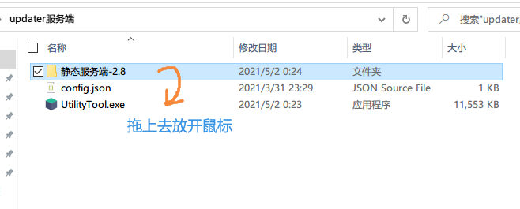

# 小工具使用教程

目前支持以下服务商的一键上传功能

+ 阿里云对象存储（推荐）
+ 腾讯云对象存储（推荐）
+ FTP/SFTP

!> 注意：无论使用什么方式上传，请务必在上传之前备份所有现有的文件

## 使用方法

1. 编辑配置文件`config.json`，然后保存退出
2. 将`静态服务端`目录拖到小工具上松开，就会开始上传
3. 
4. 小工具在上传时会自动为`self`和`res`目录各生成一个`.json`校验文件，这是正常现象，删除不会有影响

---

也可以写一个cmd脚本实现双击上传：（复制下面代码然后保存成`上传.cmd`或者`上传.bat`放到小工具旁边即可，注意文件编码为GBK）

```
@echo off
UtilityTool.exe 静态服务端-2.8
```

## 配置文件

+ 如果你使用腾讯，在`service_provider`填写`tencent`然后填写下方`tencent`内的参数即可
+ 如果你使用阿里，在`service_provider`填写`aliyun`然后填写下方`aliyun`内的参数即可
+ 如果你使用FTP，在`service_provider`填写`ftp`然后填写下方`ftp`内的参数即可

```json
{
  "service_provider": "", // 填写tencent/aliyun/ftp
  "upload_without_hashing": false, // 是否不生成.json校验文件，一般请保持false，否则客户端无法正常工作

  "tencent": {
      "bucket_name": "", // 桶名
      "secret_id": "", // 秘钥id
      "secret_key": "", // 秘钥key
      "region": "ap-chongqing" // 地域
  },
  "aliyun": {
      "bucket_name": "", // 桶名
      "access_id": "", // 秘钥id
      "access_key": "", // 秘钥key
      "region": "oss-cn-chengdu.aliyuncs.com" // 地域
  },
  "ftp": {
      "host": "127.0.0.1", // ftp主机
      "port": 21, // 端口
      "user": "ab", // 用户名
      "password": "ab", // 密码
      "base_path": "/", // 上传到哪个路径，支持子目录，默认根目录，需以/结尾
      "timezone_offset": 0, // 时区偏移，仅在服务器返回的时区不正确时使用，如果一直出现增量上传失效请尝试设置为8（中国为东八区）
      "secure": false, // 启用TLS加密（SFTP）
      "prot_p": false // 高级参数，登录后是否立即发送prot_p命令
  }
}
```

>  如果是部署到对象存储服务，请将桶的权限设置为**公共读**，不要选择公共写，会有安全隐患

小工具本身是开放源代码软件，如有不放心，可以使用子用户上传，或者[查阅源代码](https://github.com/updater-for-minecraft/UtilityTool)

<!-- tabs:start -->

## **FTP/SFTP使用限制**

1. 因为一些原因，**SFTP模式下**无法校验服务端证书

2. 因FTP协议限制，每次上传完成后会建立缓存文件`ftp.cache.json`，借此机制可以实现文件差异的快速对比，进而可以使用增量上传，如果删除此文件，会进行一次全量上传，请自行判断何时清理缓存文件

3. 因FTP协议限制，对文件内容的对比完全依赖于FTP服务端所返回的**文件修改时间**和**文件大小**，请确保服务端能正常返回这些信息

## **手动部署**

如果不想使用小工具的一键上传功能，可以选择自己手动上传，但需要在每次上传之前，重新生成一次`目录校验文件`

目录校验文件是一个以`.json`结尾的文件，放在其对应的目录旁边，通常情况下`self`目录和`res`目录各有一个目录校验文件

### 为什么要使用目录校验文件?

因为客户端完全依赖目录校验文件去计算自身与服务端的文件差异，如果文件夹内的文件有变动，就需要重新生成一次，否则客户端无法感知到服务端的文件修改

目录校验文件包含了目录里所有文件结构和信息（子目录结构、每个文件的校验和大小等）感兴趣可以亲自打开文件看一下结构。

### 生成目录校验文件

生成校验文件可以使用小工具来生成（删除掉小工具的配置文件，只保留一个主程序，小工具就会进入**校验文件生成模式**，而不是上传模式）

具体操作方法也是把`静态服务端-2.8`直接拖到小工具上松开

在生成好校验文件以后，请将校验文件和源文件一起上传到自己的服务器上即可

<!-- tabs:end -->

