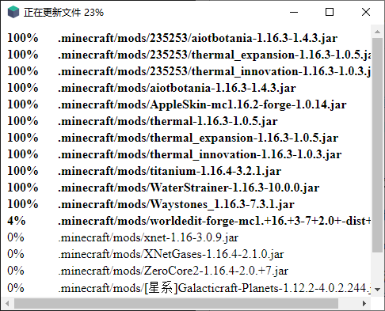

# 自定义界面

软件界面使用CEF驱动（兼容性Chrome 66），支持界面100%自定义

自定义界面需要一定的前端开发知识，建议掌握以下内容

1. HTML和CSS3
2. JS async/await
3. Vue列表渲染

---

具体步骤：

1. 访问开源仓库 https://github.com/updater-for-minecraft/UpdaterHotupdatePackage
2. 克隆或者下载Zip，拿到源代码
3. 提取出`assets`文件夹

`index.html`是首页文件

`index.js`中的`callback`对象设置了各个生命周期的回调函数，可以通过这些函数进行自定义界面

`updater.js`中保存了与Updater通信的代码和可调用的API，请不要修改此文件

`test.js`提供了模拟更新的测试函数，可以快速测试界面是否能正常运行，调用方式：`test(true)`（升级流程）、`test(false)`（普通的更新流程）

修改界面可以直接使用普通浏览器进行调试开发，完成后再加载进Updater测试效果

建议调试阶段使用带`Console`后缀的热更新包版本，便于调试问题，测试稳定后再在线上使用不带`Console`后缀的版本

4. 界面修改完毕后，将`assets`文件夹复制到服务端的`hotupdate`目录内（如果需要请更新校验文件）
5. 运行客户端，等待客户端下载`assets`文件夹，接着就可以看到实际效果了

如果可能，请尽量提前加载`updater.js`文件并注意依赖的问题

---

这是默认的界面，我的审美也就到这里了，剩余的靠大家自由发挥啦

---

## 生命周期回调函数

| 函数                              | 用途                           | 参数                     |
| --------------------------------- | ------------------------------ | ------------------------ |
| init                              | 初始化                         |                          |
| check_for_upgrade                 | 获取最新热更新信息             | url                      |
| calculate_differences_for_upgrade | 计算是否需要升级               |                          |
| whether_upgrade                   | 进行升级流程或者普通更新流程   | isupgrade                |
|                                   |                                |                          |
| 升级流程                          |                                |                          |
| upgrading_old_files               | 升级时将要删除的文件           | paths                    |
| upgrading_new_files               | 升级时将要下载的文件           | paths                    |
| upgrading_before_downloading      | 即将开始下载文件               |                          |
| upgrading_downloading             | 正在下载文件（会被调用多次）   | file, recv, bytes, total |
| upgrading_before_installing       | 即将开始安装更新（程序会退出） |                          |
|                                   |                                |                          |
| 普通更新流程                      |                                |                          |
| check_for_update                  | 正在获取最新文件的信息         | url                      |
| calculate_differences_for_update  | 正在计算是否需要更新文件       |                          |
| updating_old_files                | 更新时将要删除的文件           | paths                    |
| updating_new_files                | 更新时将要下载的文件           | paths                    |
| updating_before_removing          | 即将开始删除旧文件             |                          |
| updating_removing                 | 正在删除文件（会被调用多次）   | file                     |
| updating_before_downloading       | 即将开始下载文件               |                          |
| updating_downloading              | 正在下载文件（会被调用多次）   | file, recv, bytes, total |
| cleanup                           | 清理退出                       |                          |
|                                   |                                |                          |
| 特殊回调函数                      |                                |                          |
| alert                             | 显示警告信息                   | text                     |
| on_error                          | 发生了异常/错误                | type, detail, traceback  |

## UpdaterAPI

| 函数                        | 用途         | 参数    |
| --------------------------- | ------------ | ------- |
| updaterApi.setTitle         | 设置窗口标题 | title   |
| updaterApi.toggleFullscreen | 切换全屏     |         |
| updaterApi.minimize         | 最小化窗口   |         |
| updaterApi.restore          | 还原窗口     |         |
| updaterApi.close            | 直接关闭窗口 |         |
| updaterApi.execute          | 执行系统命令 | command |