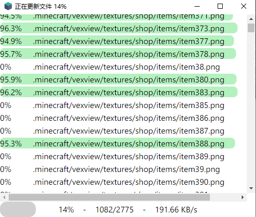

# 自定义界面

软件界面使用CEF驱动（兼容性Chrome 66），支持界面100%自定义

自定义界面需要一定的前端开发知识，建议掌握以下内容

1. HTML和CSS3
2. JS async/await
3. Vue列表渲染

---

具体步骤：

1. 访问开源仓库 https://github.com/updater-for-minecraft/UpdaterHotupdatePackage
2. 克隆或者下载Zip，拿到源代码
3. 提取出`assets`文件夹

| 文件        | 用途                                           |
| ----------- | ---------------------------------------------- |
| index.html  | 首页文件                                       |
| index.js    | 与Updater通信的生命周期的回调函数              |
| updater.js  | Updater通信的代码和可调用的API，不要修改此文件 |
| test.js     | 用于开发的时候快速测试（模拟更新过程）         |
| utils.js    | 辅助函数                                       |
| loading.gif | 加载动画                                       |
| libs目录    | JS框架（JQuery和Vue）                          |

Tips:

1. 修改界面可以直接使用普通浏览器进行调试开发，完成后再加载进Updater测试效果
2. 建议调试阶段使用带`Console`后缀的热更新包版本，便于调试问题
3. 在使用浏览器开发时，可以在网页控制台输入`testA()`和`testB()`两个函数来模拟更新流程，能更快看到效果
4. 如果需要在实际环境中测试，可以设置在配置文件`hold_ui: true`来让界面不会自动退出，同时在空白处点击右键，DeveloperTool打开开发者工具进行调试（可以查看控制台输出）

---

可以自行修改index.html内的CSS或者其它代码，修改完成后，将`assets`文件夹复制到服务端的`hotupdate`目录内，和热更新包放一起（如果需要请更新校验文件）

接着运行客户端，等待客户端同步`assets`文件夹，就可以看到实际效果了

如果可能，请尽量提前加载`updater.js`文件并注意依赖的问题

---

这是默认的界面，可能不那么完美，剩余的靠大家自由发挥啦



---

## 生命周期回调函数

| 函数                              | 用途                           | 参数                     |
| --------------------------------- | ------------------------------ | ------------------------ |
| init                              | 初始化                         | config                   |
| check_for_upgrade                 | 获取最新热更新信息             | url                      |
| calculate_differences_for_upgrade | 计算是否需要升级               |                          |
| whether_upgrade                   | 进行升级流程或者普通更新流程   | isupgrade                |
|                                   |                                |                          |
| 升级流程                          |                                |                          |
| upgrading_new_files               | 升级时将要下载的文件           | paths                    |
| upgrading_before_downloading      | 即将开始下载文件               |                          |
| upgrading_downloading             | 正在下载文件（会被调用多次）   | file, recv, bytes, total |
| upgrading_before_installing       | 即将开始安装更新（程序会退出） |                          |
|                                   |                                |                          |
| 普通更新流程                      |                                |                          |
| check_for_update                  | 正在获取最新文件的信息         | url                      |
| calculate_differences_for_update  | 正在计算是否需要更新文件       |                          |
| updating_new_files                | 更新时将要下载的文件           | paths                    |
| updating_before_downloading       | 即将开始下载文件               |                          |
| updating_downloading              | 正在下载文件（会被调用多次）   | file, recv, bytes, total |
| cleanup                           | 清理退出                       |                          |
|                                   |                                |                          |
| 特殊回调函数                      |                                |                          |
| alert                             | 显示警告信息                   | text                     |
| on_error                          | 发生了异常/错误                | type, detail, traceback  |

## UpdaterAPI

| 函数                        | 用途         | 参数    |
| --------------------------- | ------------ | ------- |
| updaterApi.setTitle         | 设置窗口标题 | title   |
| updaterApi.toggleFullscreen | 切换全屏     |         |
| updaterApi.minimize         | 最小化窗口   |         |
| updaterApi.restore          | 还原窗口     |         |
| updaterApi.close            | 直接关闭窗口 |         |
| updaterApi.execute          | 执行系统命令 | command |

## API变更记录

### 2.6.2版本

删除了以下几个回调函数

1. upgrading_old_files：升级时将要删除的文件
2. updating_old_files：更新时将要删除的文件
3. updating_before_removing：即将开始删除旧文件
4. updating_removing：正在删除文件

---

init回调函数增加了一个参数config，代表配置文件updater.settings.json对象，可以访问此文件内容，直接访问对应的属性就好，使用方法如下：

```
if(config.error_message && confirm(config.error_message))
    if(config.error_help)
    	updaterApi.execute(config.error_help)
```

---

模拟更新流程的函数`test(bool)`被拆分成`testA()`和`testB()`，分别会进行模拟升级流程和更新文件流程，在浏览器里开发时，在网页控制台输入就行

### 2.6.5f2版本

init回调函数的参数config里增加了一个属性`indev`，用来判断是否处于开发环境，这个属性只有在updater运行期间才有效