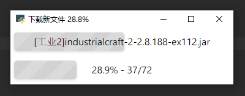

# 自定义界面

软件界面使用Electron框架打造，支持界面100%自定义

自定义界面需要一定的前端开发知识，建议掌握以下内容：

HTML和CSS3、 JS async/await、 [Vue声明式渲染](https://vuejs.bootcss.com/guide/#声明式渲染)

---

这是v3.0.0默认的界面（双进度条风格），3.0.0版本可以兼容2.x版本的界面资源。（虽然兼容2.x，但`on_error`事件回调函数的参数有变化，建议进行适配）



---

首先需要下载界面资源文件

1. 访问开源仓库 https://github.com/updater-for-minecraft/Client
2. 克隆或者下载Zip，拿到源代码
3. 提取出`src/render`文件夹
4. 文件说明：

| 文件       | 用途                                                         |
| ---------- | ------------------------------------------------------------ |
| index.html | 首页文件（主要文件）                                         |
| index.js   | 负责显示进度条和窗口标题（主要文件）                         |
| updater.js | 负责与底层通信的文件（不要修改）                             |
| test.js    | 模拟一次文件更新，可以看到实际效果                           |
| icon.png   | 程序运行时显示的图标（替换图标需要通过updater.yml更换，此文件建议直接删除） |
| libs目录   | JS框架（JQuery和Vue）                                        |

然后需要对现有文件进行修改：

本软件底层以事件的形式与上层JS通信，所以只需要监听各种事件就可以完成界面的修改

以下是各种事件触发的流程图（SVG文件）



## 监听各种事件

监听事件可以使用`updaterApi.on(eventName, callback)`进行监听

`eventName`是要监听的事件名（可以参考上图）

`callback`是一个回调函数，会在事件触发的时候被执行

在`callback`中，`this`已经被绑定为`updaterApi`变量

不需要的事件，可以不进行监听

## 事件参数

每个事件的回调函数都有不同的参数传入，可以参考下方

### init事件

初始化事件

+ `config`：配置文件`updater.yml`的JSON对象，可以在配置文件里写一些自定义的配置项目，然后从这里进行读取

### check_for_update

正在检查有没有文件需要更新

无参数

### updating_new_files

即将开始下载需要被更新的文件

`paths`：所有需要下载的文件（路径、大小）

### updating_downloading

正在下载文件（此事件会被触发多次）

- `file`：文件路径
- `recv`：数据包的大小（本次下载了多少bytes）
- `bytes`：本文件一共下载了多少bytes
- `total`：本文件的大小（in bytes）

当`recv==0 && bytes==0`满足时，表示该文件已经就绪，马上就会开始下载

当`bytes==total`满足时，表示该文件下载完毕

### cleanup

清理退出

无参数

### on_error

用于显示ppdater底层的异常/错误信息

+ `type`：异常类型
+ `detail`：异常的具体引发原因
+ `traceback`：异常的调用栈

## API

可以通过`updaterApi`变量去调用一些特殊函数，实现一些特殊功能

| 函数                          | 用途                   | 参数          |
| ----------------------------- | ---------------------- | ------------- |
| updaterApi.setTitle()         | 设置窗口标题           | title         |
| updaterApi.setFullscreen()    | 设置全屏状态           | isFullscreen  |
| updaterApi.minimize()         | 最小化窗口             |               |
| updaterApi.restore()          | 还原窗口               |               |
| updaterApi.setSize()          | 设置窗口大小           | width, height |
| updaterApi.center()           | 窗口居中（屏幕的中央） |               |
| updaterApi.close()            | 直接退出程序           |               |
| async updaterApi.execute()    | 执行系统命令           | command       |
| async updaterApi.getWorkDir() | 获取当前工作目录       |               |
| updaterApi.start()            | 开始更新文件！         |               |

## 一些需要注意的地方

软件窗口启动后不会立即开始更新文件，而是等待js层的开始信号，可以在`init`事件的回调函数中调用`this.start()`来向底层发出开始信号，底层就会开始更新文件了

```js
updaterApi.on('init', function(_config) {
    config = _config
    this.start()

    console.log(config)

    this.setTitle('文件更新')
    vue.text2 = '正在连接服务器..'
})
```

除了在`init`中调用`this.start()`以外，也可以在`init`被调用之后，再别的地方手动调用`updaterApi.start()`来发出开始信号（如果在`init`触发之前调用开始信号会报错）

## 调试的技巧

1. 修改界面可以直接使用普通浏览器进行调试开发，完成后再加载进软件里测试效果
3. 在使用浏览器开发时，可以在网页控制台输入`test()`函数来模拟更新流程，能更快看到实际效果（确保`test.js`被加载）
4. 如果需要在实际环境中测试，可以在客户端配置文件里设置`hold_ui: true`来让界面不会自动退出（需要手动叉掉），同时在空白处点击右键，DeveloperTool打开开发者工具进行调试（可以查看控制台输出）

## 保存修改

界面文件修改完以后，将`render`文件夹复制到客户端的`.minecraft/updater`目录下，并在客户端配置文件`updater.yml`中设置`assets: render/index.html `

启动客户端，就可以看到实际效果了