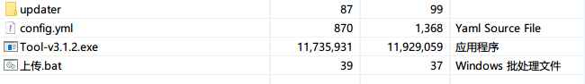
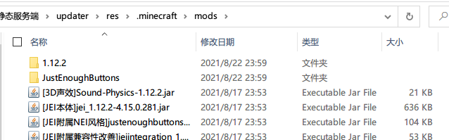

## 静态服务端安装

> 如果有对象存储的使用经验，配置起来会更加得心应手

1. 把整个`静态服务端`文件夹解压到桌面上（或者其它任何地方）

| 文件              | 用途                                   |
| ----------------- | -------------------------------------- |
| updater/res       | 存放要参与更新的文件                   |
| updater/index.yml | 服务端的配置文件                       |
| config.yml        | 小工具的配置文件                       |
| Tool.exe          | 小工具的主程序文件（用来一键上传）     |
| 上传.bat          | 启动小工具主程序的脚本（推荐这样启动） |

2. 将要更新文件，比如模组文件，复制到`updater/res/.minecraft/mods/`里面（`.minecraft/mods/`目录请自行创建）

3. 将其它要参与更新的文件同样按上面的方法，复制到对应的目录上（比如Vexview的贴图复制到`updater/res/.minecraft/vexview/textures/`下）
4. 编辑服务端配置文件`updater/index.yml`，参考下面的[服务端配置](#服务端配置)章节进行配置

5. 然后需要上传到对象存储或者其它地方，如果是上传到对象存储，则极其建议使用小工具上传来（当然也支持手动上传），请参考下面的[小工具使用教程](#小工具使用教程)章节进行操作
7. 上传完成后，服务端就配置完毕了，接下来是[客户端安装教程](客户端安装教程.md)

### 后续维护

得益于软件的同步式更新架构，后续的客户端维护其实是非常简单的：

给客户端新增文件：在服务端**添加**对应的文件，然后进行一次同步，客户端那边就会同步更新

删除客户端的文件：在服务端**删除**对应的文件，然后进行一次同步，客户端那边就会同步更新

更新客户端的文件：在服务端**替换**对应的文件，然后进行一次同步，客户端那边就会同步更新

不仅仅是文件，文件夹也是和上面一样的更新逻辑。这样，服务端的内容，就会自动同步到客户端那边。如果没有按预期更新，请检查一下对应的文件/目录是否忘了添加更新规则。

[服务端配置文件.md](服务端配置文件.md ':include')

[小工具使用教程.md](小工具使用教程.md  ':include')

