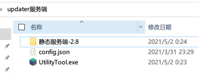
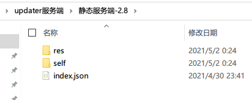
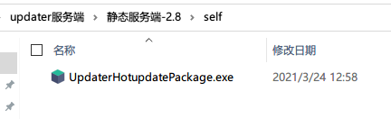
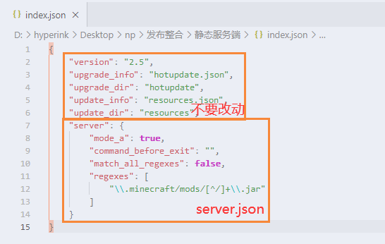
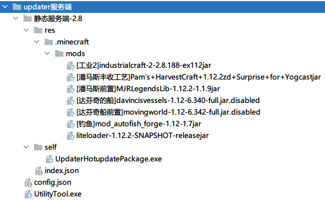
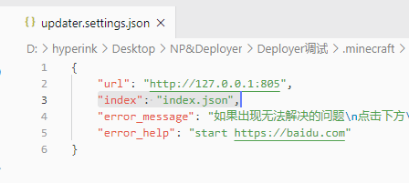

## 静态服务端安装

> 静态服务端支持到CDN上，可以进一步提升下载加速和降低流量费用

1. 在桌面上新建一个空白文件夹，名字可以随意，比如`updater服务端`
2. 将小工具解压到`updater服务端`里（包括主程序和配置文件）
3. 解压静态服务端zip包到`updater服务端`里
4. 
5. 
6. 解压热更新包，并将`UpdaterHotupdatePackage.exe`文件复制到静态服务端的`self`目录下
7. 
8. 编辑`updater服务端/静态服务端/index.json`，参考[服务端配置文件](服务端配置文件.md ':target=_blank')
9. 
10. 将需要更新的文件（如模组、资源包等）放到`resources`目录里，完整文件结构如下
11. 
12. 接下来就需要上传到对象存储或者其它地方了，推荐使用小工具上传，也可以手动上传，请参考[小工具使用教程](小工具使用教程.md ':target=_blank')
13. 到这里静态服务端就配置完毕了！接下来是[客户端安装教程](客户端安装教程.md)
14. **在配置客户端时**，需要添加一个配置项
    1. 打开updater客户端的`updater.settings.json`
    2. 新增一个字段`"index": "index.json",`
    3. 保存退出
    4. 
15. 无论何时，想要查看热更新包的版本，请点击**右键->属性->详细信息->产品版本**
16. 