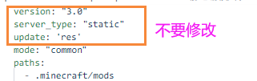

## 静态服务端安装

> 注意！！！使用静态服务端时，极其建议全程使用小工具进行上传/同步文件，小工具会在每次上传之前对文件生成一个校验文件，这一步很重要！！！我极其不建议手动上传，手动在后台一个一个文件上传**很容易**造成校验文件和实际内容对不上，更新时是会出现报错的！！！

> 后续的维护也不需要在对象存储的后台里管理文件，你只需要删除本地文件后，用小工具再上传一次，就会同步删除/上传/更新所有修改了，如果你不放心把AK交给小工具，可以使用子用户，手动上传模式，或者审查小工具的源代码。

1. 打开`静态服务端`的文件夹，编辑`静态服务端/index.yml`，参考[服务端配置文件](服务端配置文件.md ':target=_blank')
2. 
3. 将需要更新的模组文件复制到`res/.minecraft/mods`目录里（其它文件按实际路径复制就好）
4. 接下来就需要上传到对象存储或者其它地方了，推荐使用小工具上传，也可以手动上传，请参考[小工具使用教程](小工具使用教程.md ':target=_blank')
5. 到这里静态服务端就配置完毕了！接下来是[客户端安装教程](客户端安装教程.md)

