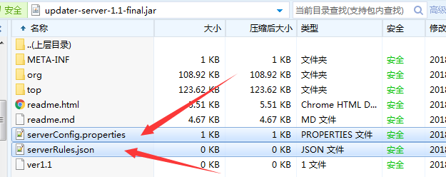
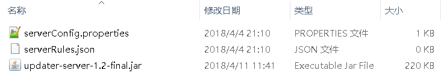
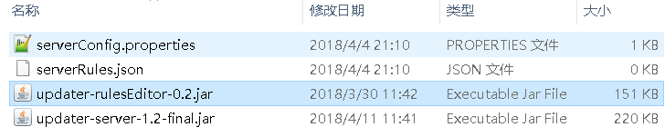
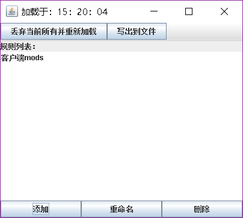
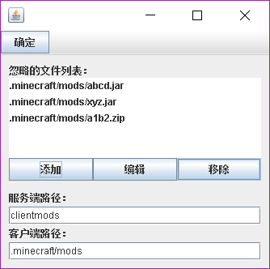
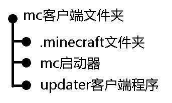
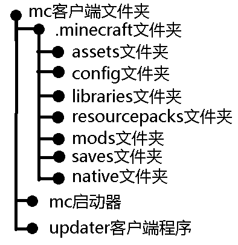
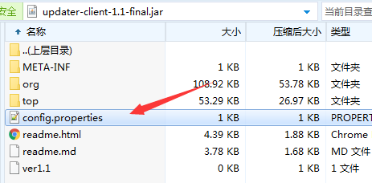

## updater详细的食用方法

> **适用于（客户端1.x，服务端1.0-1.2.0，配置小工具0.2.x）**

> 创建于2018年4月11日、最后修改于2021年1月10日

---

> 感谢[**@823123868**](http://www.mcbbs.net/home.php?mod=space&uid=778361)提供详细的食用方法和修复bug的代码

[**@823123868**](http://www.mcbbs.net/home.php?mod=space&uid=778361)的引言：

> 当初用这个时候还是1.0版本 ,那时候跟基友联机一旦加入了新MOD 又要重新发MOD真是苦恼,找到这个之后确实方便了很多。
>
> 相比于1.0版本，1.1版本新增了个动态更新(还不理解这个怎么用,所以就跳过)。    新增了个小工具配置 比起1.0只能按照格式改配置文件    好了很多(下面会详细说这个东西怎么用,用得好确实能更新~~任何~~东西)。
>
> 新增了文件忽略，1.0版本更新是对比文件然后删除多余不相同的(可恶)，1.1就人性化多了,采用的是增加式更新(就是客户端上 没有这个MD5值或者MD5值不相同 的文件就会下载下来,不会去删除其他文件(这里有要注意的配置,如果配置错误会删除其他文件！！下面服务端配置时候会详解),而且默认是不会删除文件夹)。
>
> 新增服务端命令启动,因为一直都是用window开服,这个新功能应该对linux会有很大帮助。     

>  1.1版本留下了许多bug，比如忽略文件功能无效，中文文件名的文件的文件名过长会乱码,还有为多余文件没法删除等等，这些问题在1.2都得到了修复。          

## 下载和配置

### 服务端部分

首先先打开[下载地址](https://pan.baidu.com/s/1d3TtyY)：


配置服务端是最重要的部分，所以我们先从服务端开始配置，建议选择最新版本，最新版本相对旧版本，通常更加稳定，功能更丰富


十分建议先下载到自己电脑上，配置和调试没问题以后在上传到服务器上。


现在开始配置服务端：

使用压缩软件打开刚刚下载好的服务端文件（压缩软件推荐使用2345好压和7z等等），服务端支持配置文件的内部载入，但推荐使用外部载入，这样比较直观，也便于维护。（关于配置文件的载入方式的详细说明，请参考[这里](#附件1：配置文件的载入方式)）

使用压缩软件打开后需要把里面这的2个文件解压到服务端程序的旁边



就像这个样子：



`serverConfig.properties` 这个文件保存着服务端程序的一些设置选项，比如端口，限速等等

`serverRules.json`这个文件保存着服务端程序的更新规则，比如哪几个文件夹需要更新，怎么更新等等

#### serverConfig.properties文件

使用文本编辑器打开这个文件，文件的默认内容的解释说明如下，以下内容根据实际情况配置即可。

```properties
port=5398
maxDownstreamSpeed=500
maxOnlineClient=4
clientJAR=updater-client-1.1-final.jar
```

#### port字段

这是服务端程序的端口，Minecraft通过25565这个端口来让玩家进入游戏，updater通过5398这个端口来让客户端程序可以连接进来并且更新文件。

原理可以理解为和Minecraft 25565端口一个道理一个用法，两者是同等地位的，只要额外把这个端口映射出去客户端就可以更新了，但要注意updater和minecraft是两个不同的独立的软件，两者没有直接关系，两者端口不要相同（冲突）即可

#### maxDownstreamSpeed字段

粗略限制最大下载速，小服推荐在500~1000左右，大服推荐在1000以上

#### maxOnlineClient字段

同时连接的客户端数量，可以理解为同一时间最多有多少个客户端一起更新

#### clientJAR字段

客户端核心包文件的路径，具体请参见[动态更新](#附件2：动态更新（热更新）)这里请下载好核心包，放在服务端程序的旁边，这里填写核心包的名字即可。

#### serverRules.json文件

这个文件决定了客户端更新什么内容，也是服务端配置的最重要部分。

由于这个文件配置步骤太过于复杂和极其容易出错，从服务端1.1版本开始，开始使用带有GUI界面的小工具进行配置，以大大简化配置步骤和减少出错的概率。

首先下载我们要用到小工具：


小工具建议下载最新版本。

下载完成后移动到服务端程序的同级目录（也就是服务端程序的旁边）

 就像这样：




然后使用Java打开它，是Java不是压缩软件，通常双击打开程序就会运行起来。

因为先前我们已经解压了配置文件，所以打开的时候就会自动读取`serverRules.json`。

因为我们是第一次使用，所以规则里面是空的，首先我们要先添加一个更新规则,这里以更新游戏`mods`文件夹为例，点击添加按钮，然后输入名称（这里可以理解为一个标签）（这里输入的名称只是为了自己方便辨别，输入任何内容都是可以的，和更新的过程没有任何关系，只是给你自己看和辨别用的，支持中文和特殊符号），这里以“客户端mods”为例子：




 双击后进入这个规则的详细配置



**服务端路径**：就是更新的源文件夹，客户端将以这个文件夹进行对比，将会删除这个文件夹没有的文件，下载客户端缺少的文件，这个文件夹就是更新标准，客户端以这个文件夹为标准进行更新。

**客户端路径**：与服务端路径大致同理，**注意**这里只能填写相对路径，而且通常客户端程序是和启动器放在一起的，结构如下图



如果要更新`.minecraft`文件夹里面的`mods`这个文件夹，可以写成`.minecraft/mods`
如果要更新`.minecraft`文件夹里面的`resourcepacks`这个文件夹，可以写成`.minecraft/resourcepacks`

文件结构图如下：




**小技巧1**：在客户端1.2版本以前，客户端路径前面是不能加上./的，比如“`./.minecraft/mods`”，只能写成“`.minecraft/mods`”，从1.2版本开始，这两种写法都被支持，作用效果都是一样的。

忽略文件也是只能使用相对路径，被忽略的文件，不受更新的影响，不会被删除或是下载。

**小技巧2**：在编辑详细规则的界面和输入文字的界面，点击确定按钮修改的部分才会被保存，点击右上角的`×`，修改的部分会被丢弃。

### 客户端部分

客户端的配置相对比较简单。

首先先打开[下载地址](https://pan.baidu.com/s/1d3TtyY)，选择客户端下载，推荐下载最新的版本。


 用压缩软件打开`updater-client-1.1-final.jar `，然后打开这个客户端配置文件



可以看到三个配置项：

```properties
host=hh.updaterhh.hh  //这是服务端程序的地址，可以为IP地址，也可以为域名
port=5398 //这是服务端程序对应的端口
launcherFileName=MCCL.exe //更新完后启动启动器的名字，这里不能有中文，只支持英文
```

到此客户端配置完毕

## 启动程序

### 启动服务端

服务端的启动分为托盘UI启动和命令行启动，如果服务器上没有桌面环境，可以使用命令行启动，小白推荐使用托盘UI启动，`windows server`可以使用托盘UI启动。

如果想进行托盘UI启动，直接双击运行即可。

如果想进行命令行启动，只需要加上Class 参数：`noui`即可。例子`java –jar xxx.jar noui`

### 启动客户端

直接双击启动即可

> 2021年1月10日注：可以通过HMCL的启动前指令使更新功能无缝集成到启动前，实现一键启动游戏！
>
> 指令参考：
>
> 1. java -jar updater-client-1.1-final.jar（程序放到启动前旁时）
> 2. java -jar .minecraft/updater-client-1.1-final.jar（程序放到.minecraft里时）

## 后续维护

### 服务端维护

如果需要添加或者删除更新文件夹，需要先关闭或者停止服务端程序，托盘UI直接Stop即ok，然后重载，再重新启动。

如果需要更新核心包，也需要先关闭或者停止服务端程序，更新完成后，再重新启动。

### 客户端维护

客户端由服务端的核心包自动维护，无需手动维护。

## 附件1：配置文件的载入方式

配置文件可以存在于程序旁边（外部），也可以存在于程序里面（内部），外部配置文件修改起来比较方便，内部配置文件修改起来比较麻烦，外部配置文件会影响文件夹整洁美观，可能会被误删，内部配置文件和外部配置文件正好相反，不会影响文件夹整洁美观，几乎不可能会被误删。

外部配置文件的优先级高于内部配置文件，也就是说，在外部文件和内部文件同时存在的情况下，程序读取外部文件忽略内部配置文件，没有外部文件的情况下，程序读取内部文件。

内部配置文件一般情况下请不要删除，会影响程序的正常运行。

通常情况下，推荐服务端程序使用外部配置文件，客户端程序使用内部配置文件。

## 附件2：动态更新（热更新）

从服务端1.1版本和客户端1.1版本开始，开始使用动态更新机制，简单来说就是客户端程序只是一个很小的加载器，核心的代码（更新逻辑的实现）被打包放在服务端，客户端从服务端获取核心包，然后利用java的反射机制，动态执行包里的代码。这样的好处在于修复bug或者添加新的特性之后，不必重新下载新的客户端程序，只需要更新位于服务端的核心包文件即可，在不替换原有客户端程序的情况下，运行新的代码逻辑，毕竟每次都要下载个客户端程序真的很烦，服务端1.1版本和客户端1.1版本的动态更新机制存在缺陷，以至于这个功能完全失效，请使用1.2或以上的客户端。

客户端程序只是负责建立连接，和服务端程序握手，正真的更新逻辑是在位于服务端的核心包里面的。

核心包也是Jar文件。文件名通常是`updater-core-x.x.jar`

Updater项目的4个部分，缺一不可

1. Server服务端

2. Client客户端

3. RuleEditor小工具

4. Core核心包

## 修订记录

### 2021年1月10日

从Word文档转写到Markdown文档，并作了一些名词的修正