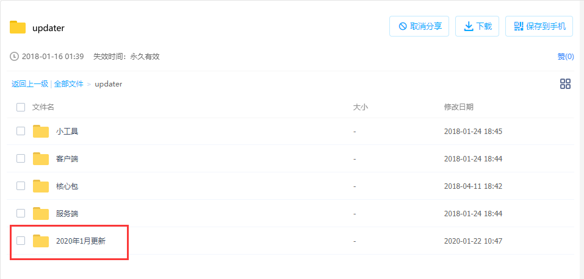
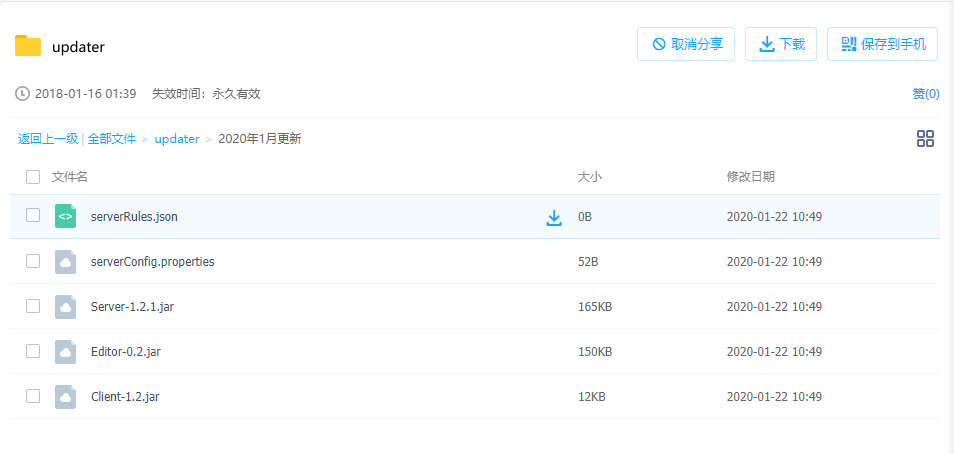
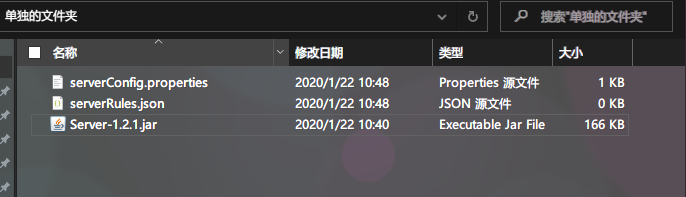
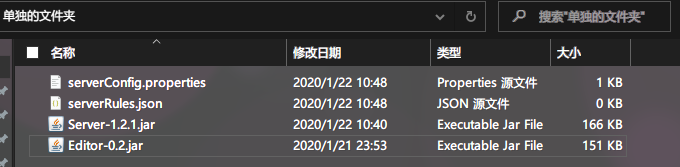
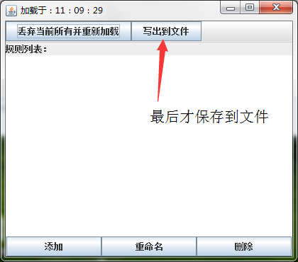
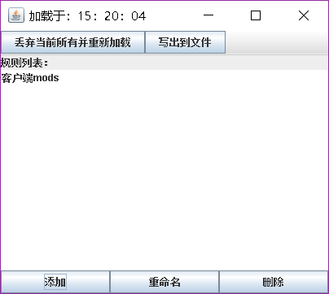
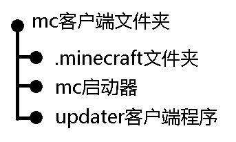
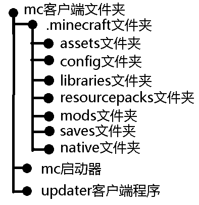
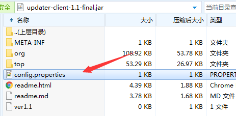

## updater详细的食用方法（1.2.2版本）

> **适用于（客户端1.x，服务端1.2.2，配置小工具0.2）**

> 创建于2020年1月22日、最后修订于2021年1月10日

---

> 感谢[**@823123868**](http://www.mcbbs.net/home.php?mod=space&uid=778361)提供详细的食用方法和修复bug的代码

[**@823123868**](http://www.mcbbs.net/home.php?mod=space&uid=778361)的引言：

> 当初用这个时候还是1.0版本 ,那时候跟基友联机一旦加入了新MOD 又要重新发MOD真是苦恼,找到这个之后确实方便了很多。
>
> 相比于1.0版本，1.1版本新增了个动态更新(还不理解这个怎么用,所以就跳过)。    新增了个小工具配置 比起1.0只能按照格式改配置文件    好了很多(下面会详细说这个东西怎么用,用得好确实能更新~~任何~~东西)。
>
> 新增了文件忽略，1.0版本更新是对比文件然后删除多余不相同的(可恶)，1.1就人性化多了,采用的是增加式更新(就是客户端上 没有这个MD5值或者MD5值不相同 的文件就会下载下来,不会去删除其他文件(这里有要注意的配置,如果配置错误会删除其他文件！！下面服务端配置时候会详解),而且默认是不会删除文件夹)。
>
> 新增服务端命令启动,因为一直都是用window开服,这个新功能应该对linux会有很大帮助。     

>  1.1版本留下了许多bug，比如忽略文件功能无效，中文文件名的文件的文件名过长会乱码,还有为多余文件没法删除等等，这些问题在1.2都得到了修复。

## 下载和配置

### 服务端部分

首先先打开[下载地址](https://pan.baidu.com/s/1d3TtyY)：（[备用下载地址](下载地址.md  ':target=_blank')）



配置服务端是最重要的部分，所以我们先从服务端开始配置，建议选择**最新版本**，最新版本相对旧版本，通常更加稳定，功能更丰富，建议选择图中最后更新的版本。



依次下载5个文件。

serverRules.json：保存着客户端程序的更新规则

serverConfig.json：保存着服务端程序的设置信息

Server-1.2.1.jar：服务端程序

Editor-0.2.jar：服务端规则编辑器

Client-1.2.jar：客户端程序

十分建议先下载到自己电脑上，配置和调试没问题以后在上传到线上服务器上。


现在开始配置服务端：

首先给服务端新建一个单独的文件夹，把`serverRules.json`和`serverConfig.json`和`Server-1.2.2.jar`放进去就像这样。



> 2021年1月10日注：图中的版本号本应该是Server-1.2.2.jar，但因为疏忽没有更新过来

服务端，从`1.2.1`版本开始已经不再支持服务端内部载入配置文件，只保留了外部载入。

`serverConfig.properties `这个文件保存着服务端程序的一些设置选项，比如端口，限速等等

`serverRules.json`这个文件保存着服务端程序的更新规则，比如哪几个文件夹需要更新，怎么更新等等

首先是对`serverConfig.properties`的配置：

使用文本编辑器打开这个文件：（三个参数根据实际情况配置即可）

```properties
port=5398
maxDownstreamSpeed=500
maxOnlineClient=4
```

#### port字段

这是服务端程序的端口，Minecraft通过25565这个端口来让玩家进入游戏，updater通过5398这个端口来让客户端程序可以连接进来并且更新文件。

原理可以理解为和Minecraft 25565端口一个道理一个用法，两者是同等地位的，只要额外把这个端口映射出去客户端就可以更新了，但要注意updater和minecraft是两个不同的独立的软件，两者没有直接关系，两者端口不要相同（冲突）即可

#### maxDownstreamSpeed字段

用粗略的算法限制最大下载速（~~不要打我~~）单位kb/s，小服推荐在300-600左右，大服推荐在1024以上，太高的值会占用过多的带宽，合适即可

#### maxOnlineClient字段

同时连接的客户端数量，可以理解为同一时间最多有多少个客户端一起更新，通常不需要设置的抬高

#### serverRules.json文件

这个文件决定了客户端更新什么内容，也是服务端配置的最核心部分。

由于这个文件配置的步骤太过于复杂和极其容易出错，从服务端1.1版本开始，开始使用带有GUI界面的小工具进行配置，以大大简化配置步骤和减少出错的概率。

首先：

我们把`Editor-0.2.jar`这个文件也复制到这个文件里来，像这样



就像这样，放在`serverRules.json`的旁边。


然后使用Java打开它，注意是Java不是压缩软件，通常双击打开程序就会运行起来(图标通常是一个咖啡杯而不是压缩文件)，Editor在打开的时候会自动读取`serverRules.json`。



因为我们是第一次使用，所以规则里面是空的，首先我们要先添加一个更新规则,这里以更新游戏`mods`文件夹为例，点击添加按钮，然后输入名称

（这里输入的名称只是为了自己方便辨别，输入任何内容都是可以的，和更新的过程没有任何关系，只是给你自己看和辨别用的，支持中文和特殊符号）

这里以“客户端mods”为例子：




 双击后进入这个规则的详细配置


**服务端路径**：就是更新的源文件夹，客户端将以这个文件夹进行对比，将会删除这个文件夹没有的文件，下载客户端缺少的文件，这个文件夹就是更新标准，客户端以这个文件夹为标准进行更新。

**客户端路径**：与服务端路径大致同理，注意这里只能填写**相对路径**，而且通常客户端程序是和启动器放在一起的，结构如下图



如果要更新`.minecraft`文件夹里面的`mods`这个文件夹，可以写成`.minecraft/mods`

 如果要更新`.minecraft`文件夹里面的`resourcepacks`这个文件夹，可以写成`.minecraft/resourcepacks`

文件结构图如下：



**小技巧1**：在客户端1.2版本以前，客户端路径前面是不能加上`./`的，比如`./.minecraft/mods`，只能写成`.minecraft/mods`，从1.2版本开始，这两种写法都被支持，作用效果都是一样的。

忽略文件也是只能使用相对路径，被忽略的文件，不受更新的影响，不会被删除或是下载。**可以是文件或者是文件夹**

**小技巧2**：在编辑详细规则的界面和输入文字的界面，点击确定按钮修改的部分才会被保存，点击右上角的`×`，修改的部分会被丢弃。

### 客户端部分

客户端的配置相对比较简单。

用压缩软件打开`Client-1.2.jar`，注意是压缩软件不是Java ，然后打开这个客户端配置文件`config.properties`直接进行编辑



可以看到三个配置项：

编辑完成后保存回压缩包里面，到此客户端配置完毕。

```properties
host=abc.com //这是服务端程序的地址，可以为IP地址，也可以为域名
port=5398 //这是服务端程序对应的端口
launcherFileName=MCCL.exe //更新完后会自动启动的启动器的名字，这里不能有中文，只支持英文
```

到此客户端配置完毕

## 启动程序

### 启动服务端

从1.2.1版本开始只支持命令行启动，不再支持托盘UI

`java –jar Server-1.2.1.jar`运行即可

### 启动客户端

直接双击启动即可

> 2021年1月10日注：可以通过HMCL的启动前指令使更新功能无缝集成到启动前，实现一键启动游戏！
>
> 指令参考：
>
> 1. java -jar Client-1.2.jar（程序放到启动前旁时）
> 2. java -jar .minecraft/Client-1.2.jar（程序放到.minecraft里时）

## 后续维护

### 服务端维护

如果需要添加或者删除更新文件夹，需要先关闭或者停止服务端程序，添加或者删除完毕后，再重新启动。

由于从1.2.1版本开始没有核心包，就不需要再单独配置核心包了

### 客户端维护

客户端由服务端的核心包自动维护，无需手动维护。

## 原理讲解1：配置文件的载入方式

配置文件可以存在于程序旁边（外部载入），也可以存在于程序里面（内部载入），外部配置文件修改起来比较方便，内部配置文件修改起来比较麻烦，外部配置文件会影响文件夹整洁美观，可能会被误删，内部配置文件和外部配置文件正好相反，不会影响文件夹整洁美观，几乎不可能会被误删。

外部配置文件的优先级高于内部配置文件，也就是说，在外部文件和内部文件同时存在的情况下，程序读取外部文件忽略内部配置文件，没有外部文件的情况下，程序读取内部文件。

内部配置文件一般不建议删除 ，如果外部文件和内部文件都不存在将无法运行

通常情况下，客户端程序推荐使用内部配置文件，当客户端程序**本身**需要更新时，因为外部文件优先级较高，可以转而使用外部文件去更新启动器名称、地址端口等常规方式无法更新的数据。

## 原理讲解2：动态更新（热更新）

从服务端1.1版本和客户端1.1版本开始，开始使用动态更新机制，简单来说就是客户端程序只是一个很小的加载器，核心的代码（更新逻辑的实现）被打包放在服务端。

客户端从服务端获取核心包，然后利用java的反射机制，动态执行包里的代码。这样的好处在于修复bug或者添加新的特性之后，不必重新下载新的客户端程序，只需要更新位于服务端的核心包文件即可，在不替换原有客户端程序的情况下，运行新的代码逻辑，毕竟每次都要下载个客户端程序真的很烦。

服务端1.1版本和客户端1.1版本的动态更新机制存在严重Bug，以至于这个功能完全失效，请使用1.2或以上的客户端。

客户端程序只是负责建立连接，和服务端程序握手，正真的更新逻辑是在位于服务端的核心包里面的。

**简而言之就是只需要更新服务端而不再需要更新客户端**

~~核心包也是Jar文件。文件名通常是`updater-core-x.x.jar`~~

~~Updater项目的4个部分，缺一不可~~

~~1. Server服务端~~
~~2. Client客户端~~
~~3. RuleEditor小工具~~
~~4. Core核心包~~

> 1.2.1版本开始动态更新机制被内嵌，不再需要手动去配置，在更新新的版本时直接删掉旧的服务端文件下载新版本服务端文件即可，客户端会不用作任何修改，会自动配合新版服务端进行工作。