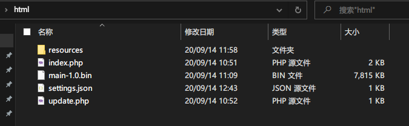
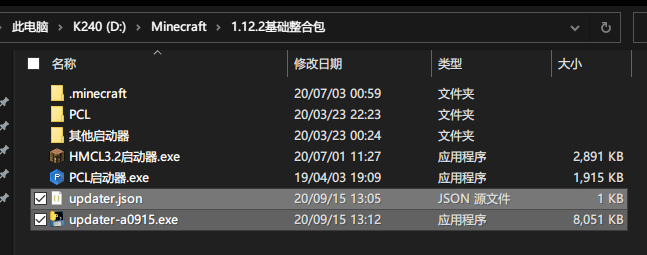
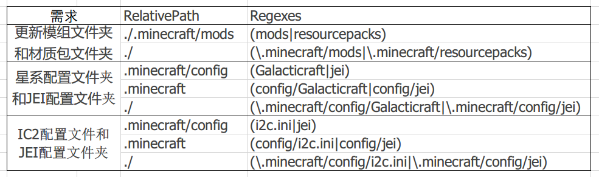
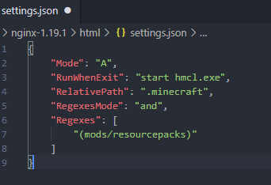

## updater详细的食用方法（2.0.0/2.0.1版本）

> **适用于（客户端2.0版本以上，服务端2.0.0/2.0.1）**

> 创建于2021年1月11日，最后修改于2021年1月13日

## 一、环境要求

服务端：php7.2或者以上
客户端：Windows 7 x64以上

下载链接：

- [客户端-2.0(a0915).zip](https://updater-for-minecraft.oss-cn-zhangjiakou.aliyuncs.com/客户端-2.0.zip)
- [动态服务端-2.0.1.zip](https://updater-for-minecraft.oss-cn-zhangjiakou.aliyuncs.com/动态服务端-2.0.1.zip)

[更多版本](下载地址.md  ':target=_blank')（下载页面顶部列出的适用版本）

## 二、服务端部署

1. 下载zip包并将所有文件解压并上传至网站目录(子目录也可以)
2. 配置settings.json文件
3. 将需要同步的文件放入resources文件夹里，可以随时删改



## 三、客户端部署

1. 下载zip包并将所有文件解压(一般是启动器旁)
2. 配置updater.json文件



## 四、服务端settings.json文件

```json
{
    "Mode": "A",
    "RunWhenExit": "",
    "RelativePath": "./test",
    "RegexesMode": "and",
    "Regexes": []
}
```

### Mode选项

本软件工作模式分 A模式 和 B模式，这里只能填"**A**"或者"**B**"，请不要填写其它的值

对于新手腐竹或者技术，推荐设置为A模式，因为B模式的使用场景非常少

**A模式：**指定需要更新/同步的文件夹，这个文件夹和服务器保持同步

**B模式：**只更新服务器已有的文件，对于没有的文件不会进行任何操作

### RunWhenExit选项

一行命令，本软件退出之前被执行，多用于唤起启动器，具体的语法参考Windows的shell命令，留空则不执行

### RelativePath选项

需要更新的**文件夹**的**相对**路径，不支持环境变量，如需要更新模组文件夹，可以设置为`.minecraft/mods`

### RegexesMode选项

**多个正则表达式之间的关系**，这里只能填"`and`"或"`or`"，请不要填写其它的值
`or`表示**任意一条**表达式匹配了就算通过
`and`表示需要**所有的**表达式全部匹配才算通过
默认推荐为`and`，除非你很清楚`and`和`or`意味着什么（学过编程应该都知道）

### Regexes选项

一个正则表达式列表

#### 在A模式下的Regexes

用来进一步精准地匹配文件夹/路径，匹配成功的文件会进行更新/同步，未能匹配的文件夹不会进行任何操作

#### 在B模式下的Regexes

匹配成功的文件会被删除掉，未能匹配的文件夹不会进行任何操作

如果此字段是一个空的列表，在A模式下会永远匹配成功，在B模式下会永远匹配失败 （这同时也是默认值）

这里可以填写多条表达式，但大多数情况下只需要一条足矣，这里的路径是以`RelativePath`作为根目录的路径，写法可以参考下方的图片，这个图片表示了当`RelativePath`和`Regexes`正确配置的关系（即`Regexes`的写法是跟随`RelativePath`进行变化的），不同的需求有不同的写法（功能是一样的），任选一行做参考即可



> 注：上图有一处错误，第一行的RelativePath应为.minecraft而不是./.minecraft/mods

### 一个完整的例子



## 五、客户端updater.json文件

```json
{
  "url": "http://127.0.0.1"
}
```

客户端配置文件非常简单，改成你的网站地址即可(指向index.php的url)，如果在浏览器直接访问，而且出现一大串json文本，即表示服务端程序正常工作。像这样：


修改完成后如果想保持游戏目录的整洁可以把配置文件移动到`.minecraft`文件夹里。启动器旁边和`.minecraft`文件夹里这两个位置都可以正常读取到的

## 六、新版本的升级方式

客户端拥有热更新特性，只需要更换新的服务端文件就可以让客户端也同步更新

## 七、为什么文件为什么那么大？

`2.0`版使用`pyqt`作为图形库，`pyinstaller`打包，尤其是`pyqt`加入进来以后，文件大小就变得非常大了，QT嘛，毕竟功能强大，所以这么大没办法。

另外`.minecraft/updater.executable.bin`为热更新包，如不再使用本软件后可以将其删除