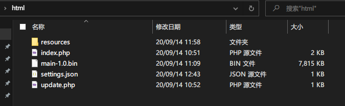
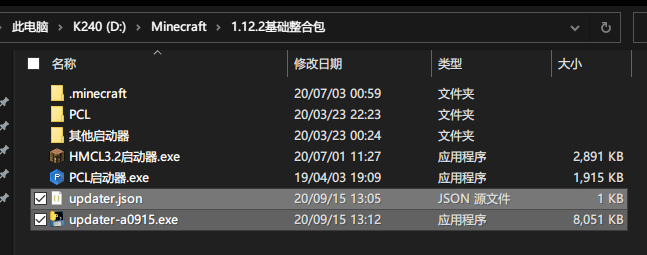
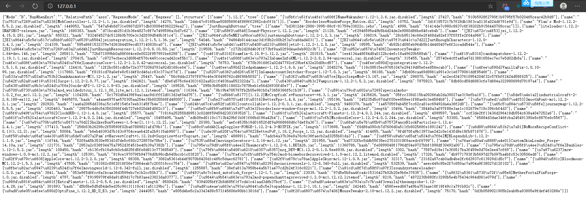

> 2.0版本使用py语言开发，支持非常多的新功能
>
> 支持两种不同的工作模式
>
> 支持热更新
>
> 支持正则表达式过滤
>
> 后端采用PHP，对面板服友好
>
> EXE打包，不需要Java依赖
>

## updater详细的食用方法

> **适用于（客户端a0922版本以上，服务端2.1.2-2.2.1）**

> 创建于2021年1月11日

## 一、环境要求

服务端：php7.2或者以上
客户端：Windows 7 x64以上

## 二、服务端部署

1. 下载zip包并将所有文件解压并上传至网站目录(子目录也可以)
2. 配置settings.json文件
3. 将需要同步的文件放入resources文件夹里，可以随时删改



## 三、客户端部署

1. 下载zip包并将所有文件解压(一般是启动器旁)
2. 配置updater.json文件



## 四、服务端settings.json文件

```json
{
    "Version": "1.2.1",
    "ModeA": true,
    "RunWhenExit": "",
    "MatchAllRegexes" : false,
    "Regexes": [ 
        "\\.minecraft"
    ],
    "Client": {
        "VisibleTime": 1000,
        "Width": 500,
        "Height": 400
    }
}
```

### Version

版本表示不要改动

### ModeA

工作模式，默认是`A`模式，可以填写`false`来调整为`B`模式，推荐默认使用`A`模式

**A模式：** 指定需要更新/同步的文件夹，这个文件夹和服务器保持同步
**B模式：** 只更新服务器已有的文件，其它的文件不会进行任何操作

### RunWhenExit

可以设置一行命令，在本软件退出之前被执行，多用于唤起启动器，具体的语法参考Windows的shell命令，默认留空表示不执行

### MatchAllRegexes

是否需要匹配所有的正则表达式才行（而不是任意一条），一般场景建议为`false`

### Regexes

可以写多条**正则表达式**来决定更新哪些文件夹，默认是`.minecraft`目录内的所有文件(这里以工作目录为起点，工作目录通常是启动器所在的目录)

另外这里需要注意一下**json文件转义字符"\\"**的影响

#### 不同工种模式下的功能

**A模式下**：正则表达式匹配的文件会被**更新**，没有匹配的**不会有**任何操作
**B模式下：**正则表达式匹配的文件会被**删除**，没有匹配会**正常地**进行更新

如果这个字段是个空列表，A模式下所有的文件夹**都不会**被更新，B模式下**不会**删除任何文件

这里的正则表达式不仅可以指向目录，也可以指向文件。

#### visible_time

设置了更新完毕后延迟多少ms退出，不建议设的太长，一般500或者500以下就好，如果还是觉得太慢，也可以设为0

#### width

更新时的窗口宽度，这个看个人喜好啦

#### height

更新时的窗口高度，这个看个人喜好啦

## 五、客户端updater.json文件

```json
{
  "url": "http://127.0.0.1"
}
```

客户端配置文件非常简单，改成你的网站地址即可(指向index.php的url)，如果在浏览器直接访问，而且出现一大串json文本，即表示服务端程序正常工作。像这样：



修改完成后如果想保持游戏目录的整洁可以把配置文件移动到`.minecraft`文件夹里。启动器旁边和`.minecraft`文件夹里这两个位置都可以正常读取到的

## 六、服务端配置文件示例

### 示例1（更新模组和资源包）

需求：我想要在A模式下更新`.minecraft/mods`和`.minecraft/resourcepacks`文件夹，其它文件夹不需要更新

```json
{
    "ModeA": true,
    "RunWhenExit": "",
    "MatchAllRegexes" : false,
    "Regexes": [
        "\\.minecraft/mods",
        "\\.minecraft/resourcepacks"
    ]
}
```

### 示例2（只更新服务器提供的模组）

我只想更新模组文件夹内以`server-`开头的服务器提供的模组文件，其它的模组文件开放给玩家自己添加

#### 方案1：A模式

```json
{
    "ModeA": true,
    "RunWhenExit": "",
    "MatchAllRegexes" : false,
    "Regexes": [
        "\\.minecraft/mods/server-.*"
    ]
}
```

#### 方案2：B模式

使用B模式甚至都不需要将模组文件特意命名为`server-`开头了，因为服务端内存在的文件才会进行更新(无论是什么文件名)，没有的文件则不会更新，这样就可以让玩家自由添加自己喜欢的模组了

```json
{
    "ModeA": false,
    "RunWhenExit": "",
    "MatchAllRegexes" : true,
    "Regexes": []
}
```

### 示例3（只更新所有.jar结尾文件）

更新.minecraft文件夹里的所有的.jar文件（包括任意子目录）(ps. 这个是我随意想出来的，实际上不可能会有这么奇怪的需求)

```json
{
    "ModeA": true,
    "RunWhenExit": "",
    "MatchAllRegexes" : true,
    "Regexes": [
        "\\.minecraft/(.*/)*.*\\.jar"
    ]
}
```

### 示例4（只更新mods文件夹所有.jar结尾文件）

有些模组会在mods文件夹里创建配置文件，这时候为了避免误删，就需要指定：只更新.jar结尾的文件，其它类型的文件或者文件夹什么的一律忽略

```json
{
    "mode_a": true,
    "command_before_exit": "",
    "match_all_regexes" : false,
    "regexes": [
        "\\.minecraft/mods/[^/]+\\.jar"
    ]
}
```

### 示例5（同时更新启动器文件、背景图片、模组）

这里要说明一下，本程序支持更新启动器本身或者相关背景或者配置文件，一般建议明确指定更新哪几个文件，而不是笼统地指定一个文件夹，如果一定要指定某个文件夹（尤其是`.minecraft`目录）时，请不要忘记给本程序设置一个白名单，不然很可能会出现误删（虽然一般不会有人这样用）

```json
{
    "ModeA": true,
    "RunWhenExit": "",
    "MatchAllRegexes" : false,
    "Regexes": [
        "HMCL.exe",
        "bg", 
        "\\.minecraft/mods" 
    ]
}
```

### 示例6（基于示例5，更新完后启动启动器）

启动请尽量用start命令启动，start命令是异步启动，不会阻塞本程序的运行，如果需要同步启动请直接启动

```json
{
    "ModeA": true,
    "RunWhenExit": "start HMCL.exe",
    "MatchAllRegexes" : false,
    "Regexes": [
        "HMCL.exe",
        "bg",
        "\\.minecraft/mods"
    ]
}
```

## 七、新版本的升级方式

客户端拥有热更新特性，只需要更换新的服务端文件就可以让客户端也同步更新

## 八、为什么文件为什么那么大？

`2.0`版使用`pyqt`作为图形库，`pyinstaller`打包，尤其是`pyqt`加入进来以后，文件大小就变得非常大了，QT嘛，毕竟功能强大，所以这么大没办法。

另外`.minecraft/updater.executable.bin`为热更新包，如不再使用本软件后可以将其删除