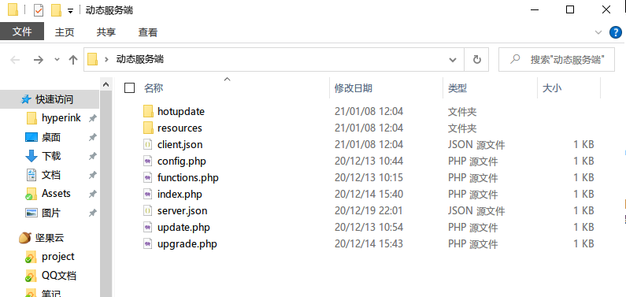
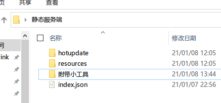
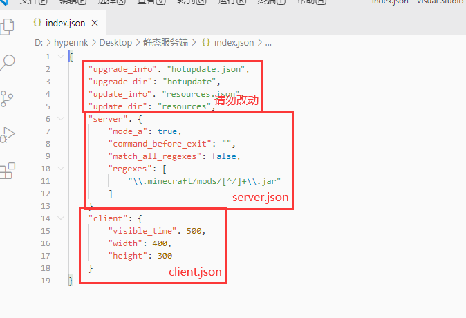
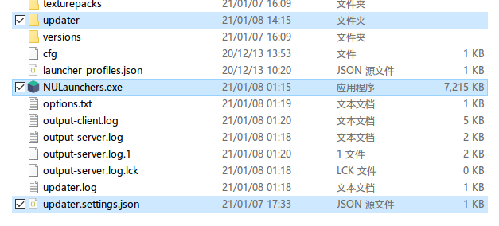
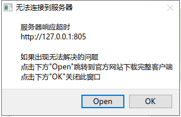

## updater帮助文档（2.4版本）

> **适用于（热更新包2.4，客户端2.0.3，动态服务端2.3，静态服务端2.4，小工具-d1.3-j1.0.1）**

> 创建于2021年1月11日，最后修改于2021年1月13日

## 一、环境要求

客户端：Windows 7 x64以上

服务端：php7.2+（动态部署）、无要求（静态部署）

下载地址：[跳转](下载地址.md  ':target=_blank')（下载页面顶部列出的适用版本）

## 二、服务端部署（动态部署/php部署）

> 动态部署即是利用php动态返回最新内容，好处是修改需要更新文件后就不用管了，即时生效。缺点是依赖php环境。

1. 下载并解压服务端Zip包，文件如下
2. 
3. 下载热更新Zip包，解压出来应该是一个EXE文件，其中x.x.x代表包的版本
4. 删掉文件名中的版本号部分，放到服务端`hotupdate`目录里
5. 
6. 编辑`client.json`和`server.json`（参考下方配置文件介绍）
7. 将需要更新的文件放到`resources`目录里，即配置完成

## 三、服务端部署（静态部署/CDN部署）

> 静态部署没有动态部署的限制，也没有运行环境要求，因此可以部署到CDN上极大提升更新速度，缺点是上传文件比较麻烦

1. 下载并解压服务端Zip包，文件如下，小工具是用来简化部署流程的
2. 
3. 下载热更新Zip包，解压出来应该是一个EXE文件，其中x.x.x代表包的版本
4. 删掉文件名中的版本号部分，放到服务端`hotupdate`目录里
5. 
6. 编辑`index.json`，server部分请参考下方`server.json`配置文件介绍，同理，client部分请参考`client.json`配置文件介绍
7. 
8. 将需要更新的文件放到`resources`目录里
9. 为`hotupdate`和`resources`生成**目录校验文件**，之后上传到服务器
10. **将网站索引文件从 index.html 或者 index.php 更改为 index.json，这一步非常重要！**
11. 完成部署！

如果是部署到对象存储服务，请打开桶的**静态网站**的功能，并设置权限为**公共读**

### 生成目录校验文件

> 所谓目录校验文件，就是一个包含了目录里所有文件结构和文件信息的一个文件，包括子目录结构，每个文件的校验和大小等信息。
>
> 客户端程序需要用目录校验文件去判断客户端文件与服务端文件的差异，从而计算出哪些文件需要更新，哪些文件需要跳过

在上传之前，请为`hotupdate`和`resources`分别生成一次校验文件（如果某个文件夹没有文件变更，就可以不用生成，直接跳过去）

生成好之后连带校验文件和源文件夹一起上传到服务器就行

如果忘了生成新的校验文件，即使把新文件传到服务器上了，客户端也不会感知到文件的变化的

#### JsonGenerator.exe

这个程序是用来生成目录校验文件用的，用法超级简单，直接把需要生成的文件夹拖上去然后放开鼠标就好了，就会在对应的目录旁生成同名.json文件啦

#### Deployer.exe

如果你准备部署到阿里云对象存储或者腾讯云对象存储，这个小工具将帮你一键完成所有操作，包括生成校验文件这一步（也就是说`JsonGenerator.exe`这一步可以直接不用做，直接跳过去），部署过程将变得非常容易

使用非常简单，将`Deployer配置文件示例`目录里对应云服务商的配置文件复制到程序旁边并配置好，将要上传的目录拖到本工具上松开，**目录内**所有的文件会被上传到桶的**根目录**

> 第一次上传时会删除桶内所有文件，请注意备份，请务必单独创建一个桶用来存放要更新的文件

##### 配置文件解析

如果是阿里云，请复制`oss.json`，如果是腾讯云，请复制`cos.json`

```
bukkit // 桶名
secret_id // API秘钥，别名access_id
secret_key // API秘钥，别名access_key
region // 地区
```

桶名：存储桶的名字

secret_id和secret_key：这个需要自己亲自去查询，建议使用子账户来提高安全性

region：桶所在的地区，阿里云一般以`oss-cn-`开头，腾讯云一般以`ap-`开头

> 如果对本程序不放心，可以滑到最下面，找到仓库地址，手动Clone到本地执行

## 四、服务端client.json文件详解

这个文件用于配置客户端窗口的一些参数

```json
{
    "visible_time": 500,
    "width": 400,
    "height": 300
}
```

`visible_time`：设置了更新完毕后延迟多少ms退出，不建议设的太长，一般500或者500以下就好，如果还是觉得太慢，也可以设为0

`width`：更新时的窗口宽度，这个看个人喜好啦

`height`：更新时的窗口高度，这个看个人喜好啦

## 五、服务端server.json文件详解

这个文件设置的详细的更新机制，下面的示例配置是默认更新所有`mods/*.jar`文件

```json
{
    "mode_a": true,
    "command_before_exit": "",
    "match_all_regexes" : false,
    "regexes": [
        "\\.minecraft/mods/[^/]+\\.jar"
    ]
}
```

### mode_a

工作模式，默认是`A`模式，可以填写`false`来调整为`B`模式，推荐使用`A`模式

**A模式：** 指定需要更新/同步的文件夹，这个文件夹和服务器保持同步

**B模式：** 只更新服务器已有的文件，其它的文件不会进行任何操作

### command_before_exit

可以设置一行命令，在本软件退出之前被执行，多用于唤起启动器，具体的语法参考Windows的shell命令，默认留空表示不执行

> 如果将本软件集成到启动器，这里可以留空

### match_all_regexes

所有的正则表达式要**全部**匹配才会更新，如果想匹配任意一条都可以的话可以设置为`false`，默认为`false`，学过编程应该知道`and`和`or`的关系，这里同理

### regexes

告诉软件，哪些文件需要进行更新， 哪些文件不需要，这里需要填写**正则表达式**，(以工作目录为起点，工作目录通常是`.minecraft`所在的目录)，另外这里需要注意一下**json文件转义字符**`\\`的影响（如果使用Vscode，语法错误会有红色高亮请留意）

如果这个字段是个空列表（即 `[]` ），A模式下所有的文件夹都不会被更新，B模式下不会删除任何文件

这里的正则表达式不仅可以指向目录，也可以指向文件。注意这里填写的是原生/原汁原味的正则表达式，请注意半角点`.` 的转义和正则表达式式的一些转义字符影响，另外路径分隔符统一用正斜线`/`表示（而不是反斜线`\`）

#### 不同工种模式下的功能

**A模式下**：正则表达式匹配的文件会被**更新**，没有匹配的不会进行任何操作

**B模式下：**正则表达式匹配的文件会被**删除**，没有匹配会**正常地**进行更新(B模式使用场景并不多)

## 六、服务端配置文件示例

> 还是不太会吗，来看看配置文件示例吧

### 示例1（更新模组和资源包）

需求：我想要在A模式下更新`.minecraft/mods`和`.minecraft/resourcepacks`文件夹，其它文件夹不需要更新

```json
{
    "mode_a": true,
    "command_before_exit": "",
    "match_all_regexes" : false,
    "regexes": [
        "\\.minecraft/mods",
        "\\.minecraft/resourcepacks"
    ]
}
```

### 示例2（只更新服务器提供的模组）

我只想更新模组文件夹内以`server-`开头的服务器提供的模组文件，其它的模组文件开放给玩家自己添加

#### 方案1：A模式

```json
{
    "mode_a": true,
    "command_before_exit": "",
    "match_all_regexes" : false,
    "regexes": [
        "\\.minecraft/mods/server-.*"
    ]
}
```

#### 方案2：B模式

使用B模式甚至都不需要将模组文件特意命名为`server-`开头了，因为服务端内存在的文件才会进行更新(无论是什么文件名)，没有的文件则不会更新，这样就可以让玩家自由添加自己喜欢的模组了

```json
{
    "mode_a": false,
    "command_before_exit": "",
    "match_all_regexes" : true,
    "regexes": []
}
```

### 示例3（只更新所有.jar结尾文件）

更新.minecraft文件夹里的所有的.jar文件（包括任意子目录）(ps. 这个是我随意想出来的，实际上不可能会有这么奇怪的需求)

```json
{
    "mode_a": true,
    "command_before_exit": "",
    "match_all_regexes" : true,
    "regexes": [
        "\\.minecraft/(.*/)*.*\\.jar"
    ]
}
```

### 示例4（只更新mods文件夹所有.jar结尾文件）

有些模组会在mods文件夹里创建配置文件，这时候为了避免误删，就需要指定：只更新.jar结尾的文件，其它类型的文件或者文件夹什么的一律忽略

```json
{
    "mode_a": true,
    "command_before_exit": "",
    "match_all_regexes" : false,
    "regexes": [
        "\\.minecraft/mods/[^/]+\\.jar"
    ]
}
```

### 示例5（同时更新启动器文件、背景图片、模组）

这里要说明一下，本程序支持更新启动器本身或者相关背景或者配置文件，一般建议明确指定更新哪几个文件，而不是笼统地指定一个文件夹，如果一定要指定某个文件夹（尤其是`.minecraft`目录）时，请不要忘记给本程序设置一个白名单，不然很可能会出现误删（虽然一般不会有人这样用）

```json
{
    "mode_a": true,
    "command_before_exit": "",
    "match_all_regexes" : false,
    "regexes": [
        "HMCL.exe",
        "bg",
        "\\.minecraft/mods"
    ]
}
```

### 示例6（基于示例5，更新完后启动启动器）

> 本示例并不适用与"集成到启动器"，因为不需要再次重复启动启动器

启动请尽量用start命令启动，start命令是异步启动，不会阻塞本程序的运行，如果需要同步启动请直接启动

```json
{
    "mode_a": true,
    "command_before_exit": "start HMCL.exe",
    "match_all_regexes" : false,
    "regexes": [
        "HMCL.exe",
        "bg",
        "\\.minecraft/mods"
    ]
}
```

## 七、客户端部署

1. 下载zip包并将所有文件解压至`.minecraft`目录下
2. 如果喜欢，可以将将`NULauncher-x.x.exe`命名为任何自己喜欢的文件名，我这里保持默认
3. 在`.minecraft`文件夹下创建一个叫`updater`的目录
4. 下载热更新Zip包，解压出来应该是一个EXE文件，其中`x.x.x`代表包的版本
5. 删掉文件名中的版本号部分，放到刚刚创建好的`updater`目录里
6. 
7. 
8. 修改updater.settings.json（参考下方配置文件介绍）
9. 配置完毕，启动测试吧

## 八、客户端updater.setttings.json配置

```json
{
    "url": "http://127.0.0.1:805",
    "error_message": "如果出现无法解决的问题\n点击下方\"Open\"跳转到官方网站下载完整客户端\n点击下方\"OK\"关闭此窗口",
    "error_help": "start https://baidu.com"
}
```

除了`url`必须要写以外`error_message`和`error_help`和可选的

#### url字段

服务器url路径，可以设置为子目录，但需要去掉结尾的`/`符号，直接在浏览器访问会出现大串大串的json文字，这代表正常工作

#### error_message

在弹出无法连接到更新服务器之类的**错误消息框**时会额外显示一个帮助信息，帮助引导玩家到指定网站下载完整客户端或者执行某个修复程序

#### error_help

点击OPEN后具体执行的命令，如果要打开一个URL，可以使用`start https://baidu.com`，如果是执行程序请参考WindowsShell



## 九、集成到启动器

>  2.4版本支持集成到启动器，再也不用像原来那样需要运行更新器，检查更新完成后才弹出启动器，这实在是太难用了

设置好后直接打开启动器，点击启动游戏按钮，然后就不用管任何事情了，在真正启动游戏之前会弹出更新窗口，更新完毕立即进入游戏，游戏体验+++

具体步骤：

1. 我们需要设置**启动前指令**，我这里以HMCL为例，在**全局游戏设置**界面，找到**启动前指令**这一项，填写`.minecraft/NULauncher.exe`，如果你在之前的步骤中修改了自己喜欢的名字，在这里也要同步修改
2. 设置好后重启HMCL，配置完成，可以直接点击启动游戏测试实际效果