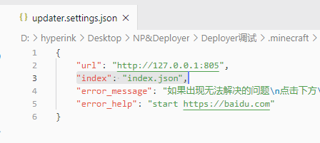

## updater详细的食用方法（2.5版本）

> **适用于（热更新包2.5，客户端2.1，动态服务端2.3，静态服务端2.4，小工具-d1.3-j1.0.1）**

> 创建于2021年1月13日，最后修改于2021年1月13日

## 零、更新记录简要

1. 客户端程序在发生错误（比如网络原因）时会返回1而不是一直返回0
2. 支持调整网站索引文件

## 一、环境要求

客户端：Windows 7 x64以上

服务端：php7.2+（动态部署）、无要求（静态部署）

>  推荐不想折腾、新手服主或技术、有现成主机空间的用户使用动态部署

>  推荐大佬们、需要部署到对象存储或者CDN上的用户使用静态部署

下载地址：[跳转](下载地址.md  ':target=_blank')（下载页面顶部列出的适用版本）

## 二、服务端部署（动态部署/php部署）

> 动态部署即是利用php动态返回最新内容，上传新文件后即时生效

1. 下载并解压服务端Zip包，文件如下
2. 
3. 下载热更新包，并将`UpdaterHotupdatePackage.exe`文件解压到服务端`hotupdate`目录里
4. 
5. 无论何时，想要查看热更新包的版本，请点击**右键**->**属性**，切换到**详细信息**，即找到**产品版本**即可
6. 
7. 编辑`client.json`和`server.json`（参考下方配置文件介绍）
8. 将需要更新的文件放到`resources`目录里，即配置完成

## 三、服务端部署（静态部署/CDN部署）

> 静态部署仅仅需要一个HTTP服务器即可，如果喜欢，可以部署到CDN上进行加速

1. 下载并解压服务端Zip包，文件如下
2. 
3. 下载小工具，并解压到你喜欢的地方（桌面上也可以），因为后面会用到这些小工具
4. 
5. 下载热更新包，并将`UpdaterHotupdatePackage.exe`文件解压到服务端`hotupdate`目录里
6. 
7. 无论何时，想要查看热更新包的版本，请点击**右键**->**属性**，切换到**详细信息**，即找到**产品版本**即可
8. 
9. 编辑`index.json`，server部分请参考下方`server.json`配置文件介绍，同理，client部分请参考`client.json`配置文件介绍
10. 
11. 将需要更新的文件放到`resources`目录里
12. 分别为`hotupdate`和`resources`生成**目录校验文件**，生成完毕后通常是5个文件
13. 
14. 将这5个文件上传到桶（Bukkit）的根目录
15. **将网站索引文件从 index.html 或者 index.php 更改为 index.json，**如果无法修改，请参考[这里](#十、无法修改网站索引文件)
16. 部署完成！

Tips：如果是部署到对象存储服务，请将桶的权限设置为**公共读**

### 生成目录校验文件

> 所谓目录校验文件，就是一个包含了目录里所有文件结构和信息的一个文件，包括子目录结构，每个文件的校验和大小等信息。感兴趣可以亲自打开文件看一下结构。
>
> 客户端程序需要用目录校验文件去判断客户端文件与服务端文件的差异，从而计算出哪些文件需要更新，哪些文件需要跳过

如果修改了`hotupdate`或者`resources`目录里的文件，请为对应的目录重新生成一次校验文件，如果没有修改，则可以跳过。如果修改了目录但忘了重新生成校验文件，客户端就没法感知到目录的变化

生成**目录校验文件**需要用到`JsonGenerator.exe`，请看下方介绍

#### JsonGenerator.exe

用法：将要生成的目录拖到`JsonGenerator.exe`上放开，就会在目录旁生成一个同名`.json`文件

#### Deployer.exe

如果你需要部署到阿里云对象存储或者腾讯云对象存储，可以用小工具一键部署（免去生成校验文件的步骤），部署过程将变得非常容易

在使用前，需要先为`Deployer.exe`准备好配置文件

1. 打开`Deployer配置文件示例`目录，复制对应的配置文件到`Deployer.exe`旁边
2. 如果是阿里云，请复制`oss.json`，如果是腾讯云，请复制`cos.json`
3. 打开`oss.json`或者`cos.json`进行编辑，具体步骤参考下方
4. 最后将`静态服务端`目录拖到`Deployer.exe`上松开，就会开始上传（当然`静态服务端`目录也可以改成自己喜欢的名字）

一些需要注意的地方：

1. 第一次上传时会删除桶内所有文件，请注意备份，建议单独创建一个桶

##### Deployer.exe配置文件

```
bukkit // 桶名
secret_id // API秘钥，别名access_id
secret_key // API秘钥，别名access_key
region // 地区
```

桶名：存储桶的名字

secret_id和secret_key：这个需要自己亲自去查询，建议使用子账户来提高安全性

region：桶所在的地区，阿里云一般以`oss-cn-`开头，腾讯云一般以`ap-`开头

## 四、服务端client.json文件详解

这个文件用于配置客户端窗口的一些参数

```json
{
    "visible_time": 500,
    "width": 400,
    "height": 300
}
```

`visible_time`：设置了更新完毕后延迟多少ms退出，不建议太长，一般500或者500以下就好，如果还是觉得太慢，可以设为0

`width`：更新时的窗口宽度，这个看个人喜好啦

`height`：更新时的窗口高度，这个看个人喜好啦

## 五、服务端server.json文件详解

这个文件决定了底层的更新逻辑，下方例子的功能：更新所有`mods/*.jar`文件

```json
{
    "mode_a": true,
    "command_before_exit": "",
    "match_all_regexes" : false,
    "regexes": [
        "\\.minecraft/mods/[^/]+\\.jar"
    ]
}
```

### mode_a

工作模式，默认是`A`模式，可以填写`false`来调整为`B`模式，推荐使用`A`模式

**A模式：** 指定需要更新/同步的文件夹，这个文件夹和服务器保持同步

**B模式：** 只更新服务器已有的文件，其它的文件不会进行任何操作

### command_before_exit

本软件退出之前可以执行一个命令，默认留空表示不执行，在老版本中多用于唤起启动器（语法参考Windows的shell命令）

### match_all_regexes

是否需要匹配**所有**正则表达式，默认为`false`，建议保持默认值

如果想任意**匹配一条表达式**就会进行更新请设置为`false`

如果想**全部的表达式都匹配**才会更新的话就需要设置为`true`

（开发者们应该都知道`and`和`or`的关系，这里同理）

### regexes

功能：设置具体要更新的目录路径（相对路径）


不同模式下，regexes的功能会发生变化：

- **A模式下**：正则表达式匹配的文件会被**更新**，没有匹配的不会进行任何操作

- **B模式下：**正则表达式匹配的文件会被**删除**，没有匹配会**正常地**进行更新(B模式使用场景并不多)


有些地方需要注意：

1. 请注意反斜杠`\`的转义问题（如果使用Vscode，语法错误会有红色高亮）
2. 如果值为空列表（即 `[]` ），A模式下所有的文件夹都不会被更新，B模式下不会删除任何文件
3. 这里填写的是原生正则表达式，请注意半角点`.` 的转义和正则表达式式的一些转义字符影响
4. 路径分隔符用正斜线`/`表示。目录路径末尾没有`/`
5. 正则表达式可能会指向目录，也可能会指向文件，请用`.`（后缀名）判断是文件还是目录（无后缀的文件暂时无法区分）

## 六、服务端配置文件示例

> 还是不太会吗，来看看配置文件示例吧

### 示例1（更新模组和资源包）

需求：我想要在A模式下更新`.minecraft/mods`和`.minecraft/resourcepacks`文件夹，其它文件夹不需要更新

```json
{
    "mode_a": true,
    "command_before_exit": "",
    "match_all_regexes" : false,
    "regexes": [
        "\\.minecraft/mods",
        "\\.minecraft/resourcepacks"
    ]
}
```

### 示例2（只更新服务器提供的模组）

我只想更新模组文件夹内以`server-`开头的服务器提供的模组文件，其它的模组文件开放给玩家自己添加

#### 方案1：A模式

```json
{
    "mode_a": true,
    "command_before_exit": "",
    "match_all_regexes" : false,
    "regexes": [
        "\\.minecraft/mods/server-.*"
    ]
}
```

#### 方案2：B模式

使用B模式甚至都不需要将模组文件特意命名为`server-`开头了，因为服务端内存在的文件才会进行更新(无论是什么文件名)，没有的文件则不会更新，这样就可以让玩家自由添加自己喜欢的模组了

```json
{
    "mode_a": false,
    "command_before_exit": "",
    "match_all_regexes" : true,
    "regexes": []
}
```

### 示例3（只更新所有.jar结尾文件）

更新.minecraft文件夹里的所有的.jar文件（包括任意子目录）(ps. 这个是我随意想出来的，实际上不可能会有这么奇怪的需求)

```json
{
    "mode_a": true,
    "command_before_exit": "",
    "match_all_regexes" : true,
    "regexes": [
        "\\.minecraft/(.*/)*.*\\.jar"
    ]
}
```

### 示例4（只更新mods文件夹里所有.jar结尾文件）

有些模组会在mods文件夹里创建配置文件，这时候为了避免误删，就需要指定：只更新.jar结尾的文件，其它类型的文件或者文件夹什么的一律忽略

```json
{
    "mode_a": true,
    "command_before_exit": "",
    "match_all_regexes" : false,
    "regexes": [
        "\\.minecraft/mods/[^/]+\\.jar"
    ]
}
```

### 示例5（同时更新启动器文件、背景图片、模组）

这里要说明一下，本程序支持更新启动器本身或者相关背景或者配置文件，一般建议明确指定更新哪几个文件，而不是笼统地指定一个文件夹，如果一定要指定某个文件夹（尤其是`.minecraft`目录）时，请不要忘记给本程序设置一个白名单，不然很可能会出现误删（虽然一般不会有人这样用）

```json
{
    "mode_a": true,
    "command_before_exit": "",
    "match_all_regexes" : false,
    "regexes": [
        "HMCL.exe",
        "bg",
        "\\.minecraft/mods"
    ]
}
```

### 示例6（基于示例5，更新完后启动启动器）

> 本示例并不适用与"集成到启动器"，因为不需要再次重复启动启动器

启动请尽量用start命令启动，start命令是异步启动，不会阻塞本程序的运行，如果需要同步启动请直接启动

```json
{
    "mode_a": true,
    "command_before_exit": "start HMCL.exe",
    "match_all_regexes" : false,
    "regexes": [
        "HMCL.exe",
        "bg",
        "\\.minecraft/mods"
    ]
}
```

## 七、客户端部署

1. 下载客户端zip包并将所有文件解压至`.minecraft`目录下

2. 如果喜欢，可以将`UpdaterClient-2.1.exe`命名为任何自己喜欢的文件名，我这里保持默认

3. 在`.minecraft`文件夹下创建一个叫`updater`的目录

4. 

5. 下载热更新包，并将`UpdaterHotupdatePackage.exe`文件解压到放到刚刚创建好的`updater`目录里

6. 

7. 修改`updater.settings.json`（参考下方配置文件介绍）

8. 配置完毕，启动测试吧

>  如果你的启动器支持**启动前指令**（如HMCL），可以参考[这里](#九、集成到启动器)，将其配置成**启动游戏之前更新文件**，这样游戏体验将大幅提升（相较之前的老版本）
>
> 如果你的启动器不支持**启动前指令**，请考虑使用`command_before_exit`主动唤起启动器

## 八、客户端updater.setttings.json配置

```json
{
    "url": "http://127.0.0.1:805",
    "error_message": "如果出现无法解决的问题\n点击下方\"Open\"跳转到官方网站下载完整客户端\n点击下方\"OK\"关闭此窗口",
    "error_help": "start https://baidu.com"
}
```

除了`url`必须要写以外`error_message`和`error_help`和可选的

#### url

服务器url路径，可以设置为子目录，但需要去掉结尾的`/`符号，直接在浏览器访问会出现大串大串的json文字，这代表正常工作

#### error_message

在弹出无法连接到更新服务器之类的**错误消息框**时会额外显示一个帮助信息，帮助引导玩家到指定网站下载完整客户端或者执行某个修复程序

#### error_help

点击OPEN后具体执行的命令，如果要打开一个URL，可以使用`start https://baidu.com`，如果是执行程序请参考WindowsShell


## 九、集成到启动器

>  2.4+版本支持集成到启动器，再也不用像原来那样需要运行更新器，检查更新完成后才弹出启动器，这实在是太难用了

设置好后直接打开启动器，点击启动游戏按钮，然后就不用管任何事情了，在真正启动游戏之前会弹出更新窗口，更新完毕立即进入游戏，游戏体验+++

具体步骤：

0. 我们需要设置**启动前指令**，我这里以HMCL为例
1. 启动HMCL，打开**（全局）游戏设置**界面，找到**启动前指令**这一项，填写`.minecraft/UpdaterClient-2.1.exe`，如果你在之前的步骤中修改了自己喜欢的名字，在这里也要同步修改
2. 
3. 重启HMCL，配置完成，可以直接点击启动游戏测试实际效果

## 十、无法修改网站索引文件

如果因为各种原因无法修改网站索引文件，可以通过在`updater.settings.json`中增加一个额外的选项来修正这个问题

具体步骤：

1. 打开`updater.settings.json`
2. 新增一个字段`"index": "index.json",`
3. 
4. 保存退出