## updater帮助文档（2.6）

书签 ：[从旧版本升级](#十二、从旧版本升级)、[常见问题](#十三、常见问题（QA环节）)

**主要更新内容**

1. 2.6版本界面使用Chromium Embedded Framework驱动，界面支持完全自定义（[教程部分](#十一、自定义界面)）
2. 出现严重错误会在工作目录生成updater.error.log文件
3. 服务端client.json配置文件内容整合到客户端配置文件内

## 一、环境要求

|          | 客户端              | 服务端       |
| -------- | ------------------- | ------------ |
| 动态部署 | Windows 7 x64或以上 | PHP7.2+      |
| 静态部署 | Windows 7 x64或以上 | 仅HTTP服务器 |

[下载地址](下载地址.md  ':target=_blank')（适用版本：热更新包2.6.x，客户端2.1.x，动态服务端2.5，静态服务端2.5，小工具1.5.1）

带`console`后缀的热更新包：建议配置阶段使用，因为有终端输出，方便排查错误

无`console`后缀的热更新包：建议实际线上环境使用，无终端黑框更美观

## 二、服务端安装（动态部署）

> 动态部署即是利用php动态返回最新内容，上传新文件后即时生效，不需要做额外修改

1. 下载并解压服务端Zip包，文件如下
2. 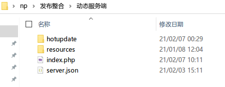
3. 下载热更新包，并将`UpdaterHotupdatePackage.exe`文件解压到服务端`hotupdate`目录里
4. 如果使用带`console`后缀的版本需要将文件名修改成与下图保持一致
5. 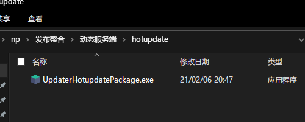
6. 无论何时，想要查看热更新包的版本，请点击**右键**->**属性**->**详细信息**->**产品版本**
7. 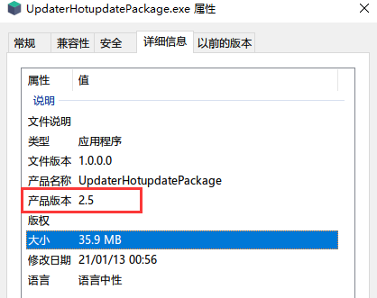
8. 编辑`server.json`（参考下方配置文件介绍）
9. 将需要更新的文件放到`resources`目录里（完整结构如下），即配置完成
10. 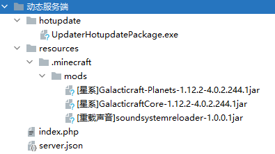

## 三、服务端安装（静态部署）

> 静态部署仅需要一个HTTP服务器，如果喜欢，可以部署到CDN上进行加速

1. 下载并解压服务端Zip包，文件如下
2. 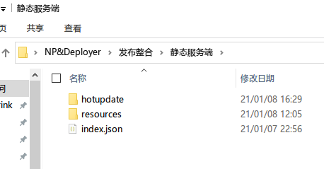
3. 下载小工具，先不用解压，后面会用到这些小工具
5. 下载热更新包，并将`UpdaterHotupdatePackage.exe`文件解压到服务端`hotupdate`目录里
5. 如果使用带`console`后缀的版本需要将文件名修改成与下图保持一致
6. 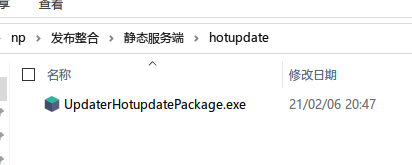
7. 无论何时，想要查看热更新包的版本，请点击**右键**->**属性**->**详细信息**->**产品版本**
8. 无论何时，想要查看热更新包的版本，请点击**右键**->**属性**，切换到**详细信息**，即找到**产品版本**即可
9. 
10. 编辑`index.json`，server部分请参考下方`server.json`配置文件介绍
11. 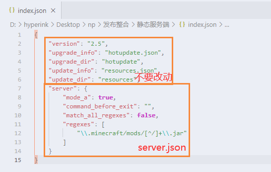
12. 将需要更新的文件（如模组、资源包等）放到`resources`目录里，完整文件结构如下
13. 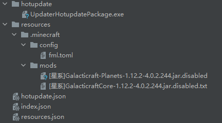
14. 分别为`hotupdate`和`resources`生成**目录校验文件**（依次拖到`Deployer.exe`上），通常是2个`.json`文件
15. 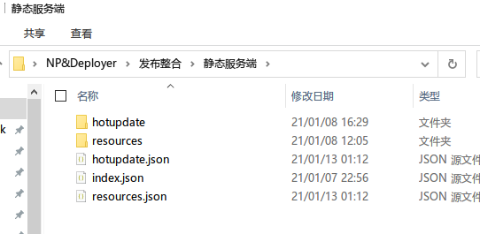
16. 将这5个文件上传到桶（bucket）的根目录
17. **将网站索引文件(默认首页)从 index.html 或者 index.php 更改为 index.json，**如果无法修改，请参考[这里](#十、无法修改网站索引文件)
18. 部署完成！

Tips：如果是部署到对象存储服务，请打开桶的**静态网站**或**静态页面**的功能，并将桶的权限设置为**公共读**，

### 生成目录校验文件

> 目录校验文件包含了目录里所有文件结构和信息，也包括子目录结构，每个文件的校验和大小等信息。感兴趣可以亲自打开文件看一下结构。
>

客户端完全依赖目录校验文件去计算自身与服务端的文件差异，如果文件夹内的文件有变动，就需要重新生成一次，否则客户端无法感知到服务端的文件修改

生成**目录校验文件**需要解压之前下载的小工具:`Deployer.exe`（只解压主程序，不要解压配置文件）

生成**目录校验文件**需要用到之前下载的小工具，请看下方介绍

具体用法：将要生成的目录拖到`Deployer.exe`上放开，就会在目录旁生成一个同名`.json`文件

## 四、对象存储服务的支持

小工具支持一键部署到对象存储服务，简单到直接把文件夹拖上去就好了，还不用手动生成校验文件

目前支持：

1. 阿里云对象存储
2. 腾讯云对象存储

### 1. 准备工作

1. 同时解压主程序`Deployer.exe`和配置文件`config.json`
2. 使用文本编辑器打开配置文件`config.json`并编辑，然后保存退出
3. 将`静态服务端`目录拖到`Deployer.exe`上松开，就会开始上传（`静态服务端`可以改成任意文件名）

一些需要注意的地方：

1. 第一次上传时会删除桶内所有文件，请注意备份，建议单独创建一个桶

### 2. 配置文件介绍

### service_provider

服务提供商，阿里云填写`aliyun`，腾讯云填写`tencent`

### bucket

桶名，存储桶的名字，这个一般是创建的时候自己填写的名字

### secret_id和secret_key

别名`access_id`和`access_key`

用于API验证。因为每家服务商获取方式不相同，需要自己亲自去查询，或者询问我也可以（下方留言或者mcbbs帖子留言）。建议使用子账户来提高安全性

### region

桶所在的地区，阿里云一般以`oss-cn-`开头，腾讯云一般以`ap-`开头

### skip_hashing_before_uploading

上传之前是否跳过生成校验文件的阶段，属于特殊用法（单纯的与桶进行同步文件）（主要是方便我自己上传打包好的构建文件的，嘿嘿），默认请保持`false`

## 五、服务端server.json文件详解

这个文件决定了底层的更新逻辑，下方例子的功能：更新所有`mods/*.jar`文件

```json
{
    "mode_a": true,
    "command_before_exit": "",
    "match_all_regexes" : false,
    "regexes": [
        "\\.minecraft/mods/[^/]+\\.jar"
    ]
}
```

### mode_a

工作模式，默认是`A`模式，可以填写`false`来调整为`B`模式，推荐使用`A`模式

**A模式：** 指定需要更新/同步的文件夹，这个文件夹和服务器保持同步

**B模式：** 只更新服务器已有的文件，其它的文件不会进行任何操作

### command_before_exit

本软件退出之前可以执行一个命令，默认留空表示不执行，在老版本中多用于唤起启动器（语法参考Windows的shell命令）

### match_all_regexes

是否需要匹配**所有**正则表达式，默认为`false`，建议保持默认值

如果想任意**匹配一条表达式**就会进行更新请设置为`false`

如果想**全部的表达式都匹配**才会更新的话就需要设置为`true`

（开发者们应该都知道`and`和`or`的关系，这里同理）

### regexes

功能：设置具体要更新的目录路径（相对路径）


不同模式下，regexes的功能会发生变化：

- **A模式下**：正则表达式匹配的文件会被**更新**，没有匹配的不会进行任何操作

- **B模式下：**正则表达式匹配的文件会被**删除**，没有匹配会**正常地**进行更新(B模式使用场景并不多)


有些地方需要注意：

1. 请注意反斜杠`\`的转义问题（如果使用Vscode，语法错误会有红色高亮）
2. 如果值为空列表（即 `[]` ），A模式下所有的文件夹都不会被更新，B模式下不会删除任何文件
3. 这里填写的是原生正则表达式，请注意半角点`.` 的转义和正则表达式式的一些转义字符影响
4. 路径分隔符用正斜线`/`表示。目录路径末尾没有`/`
5. 正则表达式可能会指向目录，也可能会指向文件，请用`.`（后缀名）判断是文件还是目录（无后缀的文件暂时无法区分）

> 如果使用IIS HTTP 服务器，文件名带+号可能会无法访问，请尽量避免此情况

## 六、服务端配置文件示例

> 还是不太会吗，来看看配置文件示例吧

### 示例1（更新模组和资源包）

需求：我想要在A模式下更新`.minecraft/mods`和`.minecraft/resourcepacks`文件夹，其它文件夹不需要更新

```json
{
    "mode_a": true,
    "command_before_exit": "",
    "match_all_regexes" : false,
    "regexes": [
        "\\.minecraft/mods",
        "\\.minecraft/resourcepacks"
    ]
}
```

### 示例2（只更新服务器提供的模组）

我只想更新模组文件夹内以`server-`开头的服务器提供的模组文件，其它的模组文件开放给玩家自己添加

#### 方案1：A模式

```json
{
    "mode_a": true,
    "command_before_exit": "",
    "match_all_regexes" : false,
    "regexes": [
        "\\.minecraft/mods/server-.*"
    ]
}
```

#### 方案2：B模式

使用B模式甚至都不需要将模组文件特意命名为`server-`开头了，因为服务端内存在的文件才会进行更新(无论是什么文件名)，没有的文件则不会更新，这样就可以让玩家自由添加自己喜欢的模组了

```json
{
    "mode_a": false,
    "command_before_exit": "",
    "match_all_regexes" : true,
    "regexes": []
}
```

### 示例3（只更新所有.jar结尾文件）

更新.minecraft文件夹里的所有的.jar文件（包括任意子目录）(ps. 这个是我随意想出来的，实际上不可能会有这么奇怪的需求)

```json
{
    "mode_a": true,
    "command_before_exit": "",
    "match_all_regexes" : true,
    "regexes": [
        "\\.minecraft/(.*/)*.*\\.jar"
    ]
}
```

### 示例4（只更新mods文件夹里所有.jar结尾文件）

有些模组会在mods文件夹里创建配置文件，这时候为了避免误删，就需要指定：只更新.jar结尾的文件，其它类型的文件或者文件夹什么的一律忽略

```json
{
    "mode_a": true,
    "command_before_exit": "",
    "match_all_regexes" : false,
    "regexes": [
        "\\.minecraft/mods/[^/]+\\.jar"
    ]
}
```

### 示例5（同时更新启动器文件、背景图片、模组）

这里要说明一下，本程序支持更新启动器本身或者相关背景或者配置文件，一般建议明确指定更新哪几个文件，而不是笼统地指定一个文件夹，如果一定要指定某个文件夹（尤其是`.minecraft`目录）时，请不要忘记给本程序设置一个白名单，不然很可能会出现误删（虽然一般不会有人这样用）

```json
{
    "mode_a": true,
    "command_before_exit": "",
    "match_all_regexes" : false,
    "regexes": [
        "HMCL.exe",
        "bg",
        "\\.minecraft/mods"
    ]
}
```

### 示例6（基于示例5，更新完后启动启动器）

> 本示例并不适用与"集成到启动器"，因为不需要再次重复启动启动器

启动请尽量用start命令启动，start命令是异步启动，不会阻塞本程序的运行，如果需要同步启动请直接启动

```json
{
    "mode_a": true,
    "command_before_exit": "start HMCL.exe",
    "match_all_regexes" : false,
    "regexes": [
        "HMCL.exe",
        "bg",
        "\\.minecraft/mods"
    ]
}
```

## 七、客户端部署

1. 下载客户端zip包并将所有文件解压至`.minecraft`目录下

2. 如果喜欢，可以将`UpdaterClient-2.1.1.exe`命名为任何自己喜欢的文件名，我这里保持默认

3. 在`.minecraft`文件夹下创建一个叫`updater`的目录

4. 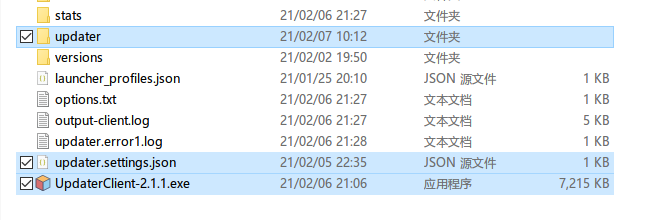

5. 下载热更新包，并将`UpdaterHotupdatePackage.exe`文件解压到放到刚刚创建好的`updater`目录里

6. 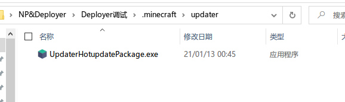

7. 修改`updater.settings.json`（参考下方配置文件介绍）

8. 配置完毕，启动测试吧

>  如果你的启动器支持**启动前指令**（如HMCL），可以参考[这里](#九、集成到启动器)，将其配置成**启动游戏之前更新文件**，这样游戏体验将大幅提升（相较之前的老版本）
>
> 如果你的启动器不支持**启动前指令**，请考虑使用`command_before_exit`主动唤起启动器

## 八、客户端updater.settings.json配置

```json
{
    "url": "http://127.0.0.1:7750",
    "visible_time": 500,
    "width": 500,
    "height": 400
}
```

### url

服务器url路径，可以设置为子目录，但需要去掉结尾的`/`符号，直接在浏览器访问会出现大串大串的json文字，这代表正常工作

### visible_time

设置了更新完毕后延迟多少ms退出，不建议太长，一般500或者500以下就好，如果还是觉得太慢，可以设为0

### width

更新时的窗口宽度，这个看个人喜好啦

### height

更新时的窗口高度，这个看个人喜好啦

## 九、集成到启动器

>  2.4+版本支持集成到启动器，再也不用像原来那样需要运行更新器，检查更新完成后才弹出启动器，这实在是太难用了

> PCL2目前暂不支持启动前指令，可以转而使用自定义界面添加一个更新按钮，当更新文件以后再让玩家点击检查更新即可

设置好后直接打开启动器，点击启动游戏按钮，然后就不用管任何事情了，在真正启动游戏之前会弹出更新窗口，更新完毕立即进入游戏。

具体步骤：

0. 我们需要设置**启动前指令**，以HMCL为例
1. 启动HMCL，打开**（全局）游戏设置**界面，找到**启动前指令**这一项，填写`.minecraft/UpdaterClient-2.1.1.exe`，如果你在之前的步骤中修改了自己喜欢的名字，在这里也要同步修改
2. （下面的配图应该是2.1.1，但是我懒得更新了，大家明白就好）
3. 
4. 重启HMCL，配置完成，可以直接点击启动游戏测试实际效果

## 十、无法修改网站索引文件

如果无法修改网站索引文件，请按下方步骤操作

具体步骤：

1. 打开`updater.settings.json`

2. 新增一个字段`"index": "index.json",`

3. 保存退出

   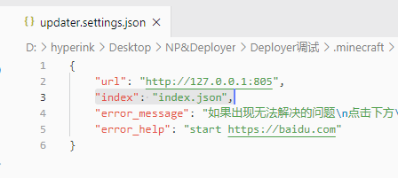

   

## 十一、自定义界面

如果你会熟练地使用HTML、JS、CSS等工具，那么你完全可以定制一套自己的界面（兼容性Chrome 66）

1. 访问开源仓库 https://github.com/updater-for-minecraft/UpdaterHotupdatePackage
2. 克隆或者下载Zip，拿到源代码
3. 提取出`assets`文件夹

`index.html`不用说，首页文件

`index.js`中的`callback`对象设置了各个生命周期的回调函数，可以通过这些函数进行自定义界面

`updater.js`中保存了与Updater通信的代码和可调用的API，请不要修改此文件

`test.js`提供了模拟更新的测试函数，可以快速测试界面是否能正常运行，调用方式：`test(true)`（升级流程）、`test(false)`（普通的更新流程）

修改界面可以直接使用普通浏览器进行调试开发，完成后再加载进行Updater测试效果

建议调试阶段使用带`Console`后缀的热更新包版本，便于调试问题，测试稳定后再在线上使用不带`Console`后缀的版本

4. 界面修改完毕后，将`assets`文件夹复制到服务端的`hotupdate`目录内（如果需要请更新校验文件）
5. 运行客户端，等待客户端下载`assets`文件夹，接着就可以看到实际效果了

如果可能，请尽量提前加载`updater.js`文件并注意依赖的问题

---

这是默认的界面，我的审美也就到这里了，剩余的靠大家自由发挥啦

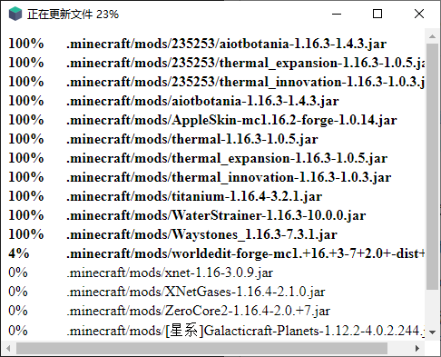

---

### 生命周期回调函数

| 函数                              | 用途                           | 参数                     |
| --------------------------------- | ------------------------------ | ------------------------ |
| init                              | 初始化                         |                          |
| check_for_upgrade                 | 获取最新热更新信息             | url                      |
| calculate_differences_for_upgrade | 计算是否需要升级               |                          |
| whether_upgrade                   | 进行升级流程或者普通更新流程   | isupgrade                |
|                                   |                                |                          |
| 升级流程                          |                                |                          |
| upgrading_old_files               | 升级时将要删除的文件           | paths                    |
| upgrading_new_files               | 升级时将要下载的文件           | paths                    |
| upgrading_before_downloading      | 即将开始下载文件               |                          |
| upgrading_downloading             | 正在下载文件（会被调用多次）   | file, recv, bytes, total |
| upgrading_before_installing       | 即将开始安装更新（程序会退出） |                          |
|                                   |                                |                          |
| 普通更新流程                      |                                |                          |
| check_for_update                  | 正在获取最新文件的信息         | url                      |
| calculate_differences_for_update  | 正在计算是否需要更新文件       |                          |
| updating_old_files                | 更新时将要删除的文件           | paths                    |
| updating_new_files                | 更新时将要下载的文件           | paths                    |
| updating_before_removing          | 即将开始删除旧文件             |                          |
| updating_removing                 | 正在删除文件（会被调用多次）   | file                     |
| updating_before_downloading       | 即将开始下载文件               |                          |
| updating_downloading              | 正在下载文件（会被调用多次）   | file, recv, bytes, total |
| cleanup                           | 清理退出                       |                          |
|                                   |                                |                          |
| 特殊回调函数                      |                                |                          |
| alert                             | 显示警告信息                   | text                     |
| on_error                          | 发生了异常/错误                | type, detail, trackback  |

### UpdaterAPI

| 函数                        | 用途         | 参数    |
| --------------------------- | ------------ | ------- |
| updaterApi.setTitle         | 设置窗口标题 | title   |
| updaterApi.toggleFullscreen | 切换全屏     |         |
| updaterApi.minimize         | 最小化窗口   |         |
| updaterApi.restore          | 还原窗口     |         |
| updaterApi.close            | 直接关闭窗口 |         |
| updaterApi.execute          | 执行系统命令 | command |

## 十二、从旧版本升级

本软件本身支持热更新，可以在每次启动时自动升级到服务端内的最新版本

1. 下载新版的热更新包
2. 解压，覆盖掉服务端`hotupdate`目录内的同名文件
3. 如果是静态服务端，重新生成校验文件，动态服务端可跳过此步骤
4. 上传到服务器即可，客户端会在下次运行时自动进行升级

---


因Windows机制所致，不能删除运行中的文件，所以无法对**客户端程序**`UpdaterClient-x.x.exe`文件自身进行更新，只能以重新发布MC客户端压缩包的形式来更新这个文件（这个文件BUG相对很少，我也不会经常对这个文件进行更新）

## 十三、常见问题（QA环节）

### Q：使用HMCL时无法连接到更新服务器却能继续启动游戏

这种情况多发生于使用启动前指令启动本软件的场景下，因为HMCL机制的问题，无法处理本程序传递出的错误，也就会继续运行了。不过此问题影响并不大。

此问题暂时无解，如果实在觉得不能接受，可以在弹出相应提示后，在JS内调用`updaterApi.execute`函数执行系统`taskill`命令强制干掉HMCL的进程来终止MC启动

其它启动器暂未发现此问题

### Q：弹框：出现异常: error

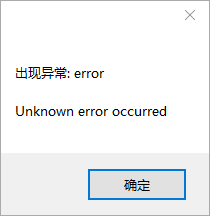

具体原因为Python代码的异常，传递到JS层后却没能正常显示错误详情

以下解决方法任选其一即可

#### 解决方法1（推荐）

升级到2.6.1版本，此版本修复了`index.js`的逻辑问题，可以显示错误详情

#### 解决方法2

1. 从源码仓库克隆2.6alpha3的Commit的源文件（https://github.com/updater-for-minecraft/Hotupdate/tree/4d177fb65b00d931107c0606b2a756864369cf60）
2. 复制仓库下的`assets`目录到服务端的`hotupdate`目录下
3. 打开`assets/index.js`，跳转到159行`on_error`函数
4. 在`detail+'\n'`后面添加`+trackback`语句，使其变成`alert('出现异常: '+type+'\n\n'+detail+'\n'+trackback)`即可完整输出报错信息
5. 保存退出
6. 重新运行客户端等待升级完毕后即可输出异常信息

