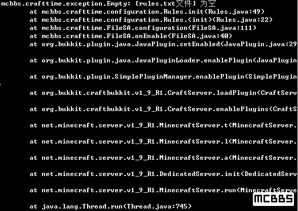
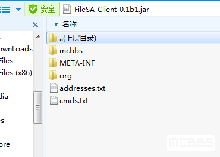
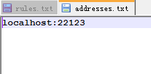
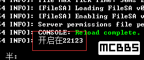

> [原创插件] [服务端插件] [管理]FileSA——更新客户端文件,模组,资源包,配置文件,皮肤,支持文件夹,md5[1.6-1.9]
>
> 原ClientUpdater项目

> 创建于2016年6月21日、最后修订于2021年1月11日

> 本文档仅做备份归档用途（[备用下载地址](下载地址.md  ':target=_blank')）

---

## 重要

服务端和客户端最低JAVA8

服务端版本更新至0.2，可以独立运行(无bukkit)，并增加了调试开关，一般情况请不要动它

## HEAD

这个插件适用于安装了更新非常频繁的mod的服务器，可以很方便的更新新版本的mod，而不用重新下载整合包

## 特性

可以很方便的让客户端mod和服务端mod保持同步

## 服务端教程：

1. 下载插件，把插件放到插件文件夹里面
2. 重启服务器
3. 第一次使用可能会报错
4. 
5. 这个报错先不理它
6. 打开插件文件夹，找到FileSA文件夹，如果安装了ClientUpdate还在的话，可以考虑删掉
7. 打开FileSA文件夹，可以看到
8. 
9. config.yml和rules.txt
10. 新版本工作的方式变了，客户端要更新那些文件都是由服务端决定的
11. 打开config.yml
12. 
13. port是定义更新的端口的
14. maxspeed是用来限制传送的速度的，单位是KB/s，默认最大速度是600KB/s，可以自己该但不能为负
15. 接下来关掉config.yml打开rules.txt
16. 
17. rules.txt默认是空的，这个文件是定义有哪些文件夹需要同步的，可以定义多个文件夹，比如模组文件夹，材质包文件夹，配置文件文件夹
18. 
19. 这是格式和一个例子
20. 一行一个，用两个`#`隔开
21. 比如我要同步mods文件夹，
22. 昵称:昵称可以随便填写，昵称是便于自己辨认的比如mods文件夹的就填mods,mymods,mod都可以
23. 远程路径，指客户端文件夹的位置，比如把客户端和启动器放在一起，mods文件夹在`.minecraft/version/1.8/mods`里面，这里填写`.minecraft//version//1.8//mods//`注意是双`//`杠
24. 本地路径:是指服务端文件夹的位置，比如我要同步服务器的mod，填写`mods//`就行,如果不在这里，在别的文件夹，里面的话也是按照这个格式
25. 成果就是`mymods#.minecraft//version//1.8//mods//#mods//`，用#隔开，所以文件夹名字里面
26. 注意，这个对格式要求非常严格，有一点不对插件就不工作，比如多一个回车空格，或者存在特殊字符
27. 到这里就配置完了
28. 给一个我的例子
29. 
30. 到此结束

## 客户端教程：

1. 客户端相对比较简单
2. 右键压缩文件打开
3. 
4. 只有两个需要配置的
5. 先打开address.txt
6. 
7. 先把localhost:22123删了
8. 一行一句，直接填写服务器地址和端口就行，英文冒号隔开，格式仍然很严格，不要多回车空格，或出现特殊字符，比如`■√‥??`
9. 配置好后关掉，打开cmds.txt
10. cmds.txt默认默认是空的，用来写命令的，会一条一条的执行，用指令可以实现同步完成自动运行启动器的效果，如果不懂这个可以直接跳过，这个不是必须的，如有需要可以百度‘Windows批处理’
11. 到此结束

## 服务端的使用：

运行服务器，看到这个字样说明开启成功

## 客户端的使用

直接双击运行

## 指令

无

## 权限

无

## 再说几句

1. 如有需要请做好对应端口映射，和mc一样
2. 插件采用异步线程工作，不会影响服务器tps
3. 服务端那部分是插件；客户端那部分应用程序而不是mod

## 服务端更新记录：

0.1b1:
| 1.支持文件夹
| 2.支持多个文件夹，可更新模组文件夹，材质包文件夹，配置文件文件夹等
| 3.支持md5验证，完全一样的文件就跳过，避免浪费流量
| 4.支持多地址，可与多个服务器互相同步
| 5.支持限速，避免过多占用带宽
| 5.精简配置文件
| 6.汉化部分日志文件内容
| 7.请求文件时会在后台发出通知，格式[昵称######文件夹####文件]
| 8.新增rules.txt文件，客户端的更新规格从服务端获取，避免反复更新客户端
| 9.修改默认端口为22123
0.1b2:
| 1.修复修复文件太多无法更新的问题
| 2.修改默认端口为26542
| 3.去除控制台调试信息
0.2:
| 1.可以独立运行，命令行格式为java -jar *.jar c 端口 最大速度(KB/s) rules.txt      注意：rules.txt必须和jar放在一起

## 地址

新版本：
本帖的插件版本已经不再更新！请移步到 [[原创|开源\]updater——更新客户端文件小程序，Mod服好帮手，2020诈尸小更新](https://www.mcbbs.net/thread-711833-1-1.html) 这个帖子，新版修复了许多旧版本遗留的严重BUG(比如忽略文件无法生效,增加了热更新功能)，因为有一段时间此账号丢失但后来被找回所以不常登录此账号，有问题请联系 [innc](https://www.mcbbs.net/home.php?mod=space&uid=2096047) ，不要联系此账号

老版本：(此链接仅做归档用，不建议访问，请移步使用新版本)
[百度云](http://pan.baidu.com/s/1qYkYnpU) / [https://pan.baidu.com/s/1c2xCbWc](https://pan.baidu.com/s/1c2xCbWc)